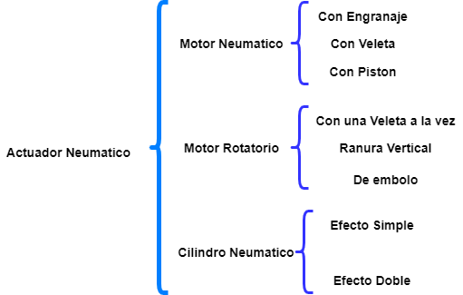

# Actuadores

## :trophy: C2.1 Reto en clase

**Actuadores Neumatico e Hidraulicos, y sus tipos**

### :blue_book: Instrucciones

- De acuerdo con la información presentada por el asesor referente al tema actuadores y a los videos observados sobre el mismo tema, elabore lo que se solicita dentro del apartado desarrollo.
- Toda actividad o reto se deberá realizar utilizando el estilo **MarkDown con extension .md** y el entorno de desarrollo VSCode, debiendo ser elaborado como un documento **single page**, es decir si el documento cuanta con imágenes, enlaces o cualquier documento externo debe ser accedido desde etiquetas y enlaces.
- Es requisito que el archivo .md contenga una etiqueta del enlace al repositorio de su documento en Github, por ejemplo **Enlace a mi GitHub**
- Al concluir el reto el reto se deberá subir a github el archivo .md creado.
- Desde el archivo **.md** se debe exportar un archivo **.pdf** con la nomenclatura **C2.1_NombreAlumno_Equipo.pdf**, el cual deberá subirse a classroom dentro de su apartado correspondiente, para que sirva como evidencia de su entrega; siendo esta plataforma **oficial** aquí se recibirá la calificación de su actividad por individual.
- Considerando que el archivo .pdf, fue obtenido desde archivo .md, ambos deben ser idénticos y mostrar el mismo contenido.
- Su repositorio ademas de que debe contar con un archivo **readme**.md dentro de su directorio raíz, con la información como datos del estudiante, equipo de trabajo, materia, carrera, datos del asesor, e incluso logotipo o imágenes, debe tener un apartado de contenidos o indice, los cuales realmente son ligas o **enlaces a sus documentos .md**, _evite utilizar texto_ para indicar enlaces internos o externo.
- Se propone una estructura tal como esta indicada abajo, sin embargo puede utilizarse cualquier otra que le apoye para organizar su repositorio.  
``` 
| readme.md
| | blog
| | | C2.1_x.md
| | | C2.2_x.md
| | | C2.3_x.md
| | img
| | docs
| | | A2.1_x.md
| | | A2.2_x.md
```

### :pencil2: Desarrollo

Listado de preguntas:

1. Basándose en el video [actuadores en Robótica](https://www.youtube.com/watch?v=e_6rjEGWqoY), realice un cuadro sinóptico sobre la clasificación de los actuadores.



2. De acuerdo con el video [descripcion de los actuadores industriales](https://www.youtube.com/watch?v=mFsPxpFHajM) realice una matriz comparativa indicando clasificacion, subclasificacion, principio de funcionamiento, ventajas y desventajas.

| Tipo de Actuador| Clasificacion | SubClasificacion | Principio de funciomaciento | Ventaja | Desventaja | 
 | ------ | --------- | -------------------- | -------------------- | -------------------- |-------------------- |
 |Neumatico|De efecto simple, Cilindro neumático, Actuador neumático de efecto doble, Motor neumático con veleta, Con pistón, Con una veleta a la vez, Multi Veleta, Motor giratorio con pistón|De ranura vertical, De émbolo, Fuelles, diafragma y músculo artificial, Cilindro de efecto simple|Son mecanismos que convierten la energía del aire comprimido en trabajo mecánico. |Utiliza gas comprimido como fuente de energía. Entre los tres tipos de actuadores, el actuador neumático tiene las ventajas de prueba de fuego, explosión, ubicación segura de fallas y operación simple. |La desventaja del actuador neumático es su poca estabilidad, que se debe a la compresibilidad del gas, lo que hace que el actuador neumático carezca de un rendimiento suficiente de compensación.|
  |Hidraulico|Efecto simple y de acción doble|Cilindro hidráulico, Motor hidráulico, Motor hidráulico de oscilación.|Se conecta la presión hidráulica a uno de los lados del émbolo o veleta generando una fuerza en sentido de la expansión del espacio entre el émbolo y la pared del cilindro o el cuerpo.|Son muchas, como un gran empuje de salida, buena resistencia de desplazamiento, control preciso, velocidad de respuesta rápida, operación estable, etc. El actuador hidráulico es accionado por líquido. |Son el alto costo y el gran volumen. Para hacer funcionar el actuador hidráulico, se requieren estaciones hidráulicas y oleoductos. |
   |Electrico|Corriente Directa, Corriente Alterna, Corriente de paso|Motores, Corriente, Continua |Un motor eléctrico mueve un reductor. El par en la salida del reductor se transmite a la válvula mediante un interfaz mecánico estandarizado|El actuador eléctrico tiene un gran empuje de salida y alta estabilidad, pero al mismo tiempo el costo es menor que el actuador hidráulico, que es una opción rentable.|El control de parámetros del actuador eléctrico es muy preciso, pero su estructura es compleja, la tasa de falla es más alta que la del actuador neumático y requiere personal profesional.|


1. De acuerdo con el video [Neumática Industrial](https://www.youtube.com/watch?v=Wee85cI6wwQ&t=394s), explique como trabaja un sistema Neumático?

Un sistema neumático generalmente utiliza un compresor de aire para reducir el volumen de aire, aumentando así la presión del gas. El gas presurizado viaja a través de mangueras neumáticas y es controlado por válvulas en el camino al actuador. El suministro de aire en sí debe ser filtrado y monitoreado constantemente para mantener el sistema operando eficientemente y los diferentes componentes funcionando correctamente. Esto también ayuda a asegurar una larga vida útil del sistema.

### :bomb: Rubrica

| Criterios     | Descripción                                                                                  | Puntaje |
| ------------- | -------------------------------------------------------------------------------------------- | ------- |
| Instrucciones | Se cumple con cada uno de los puntos indicados dentro del apartado Instrucciones?            | 20 |
| Desarrollo    | Se respondió a cada uno de los puntos solicitados dentro del desarrollo de la actividad?     | 80      |

[:arrow_left: Volver al Índice](../README.md)

[:bookmark_tabs: Repositorio en GitHub](https://github.com/CarolinaDominguez18/SistemasProgramables)