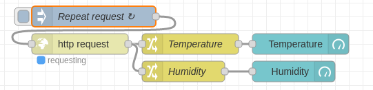
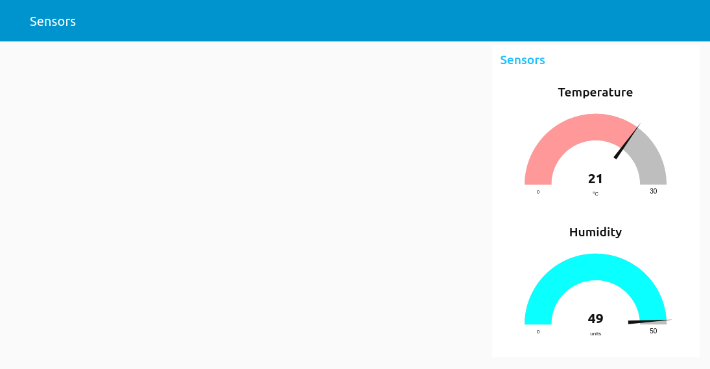
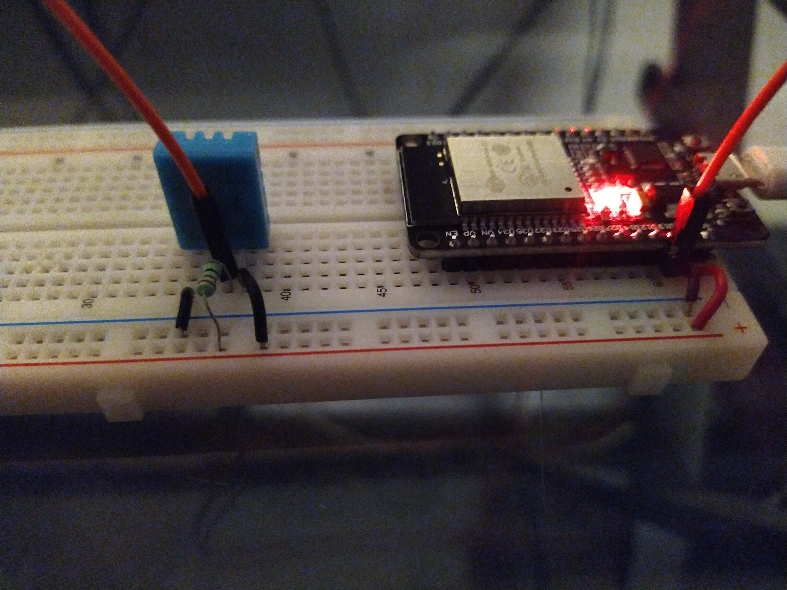
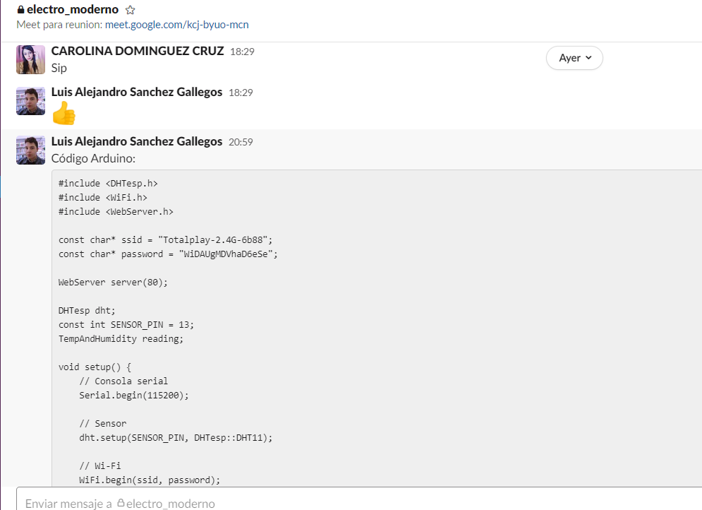
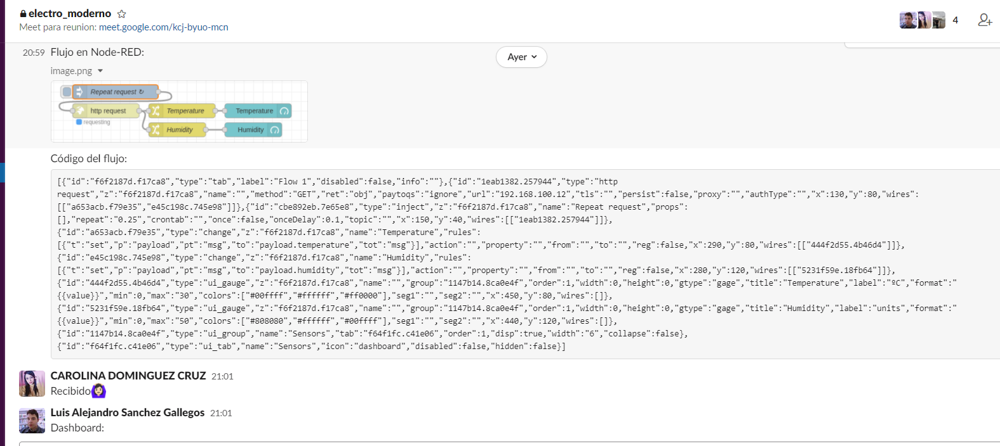
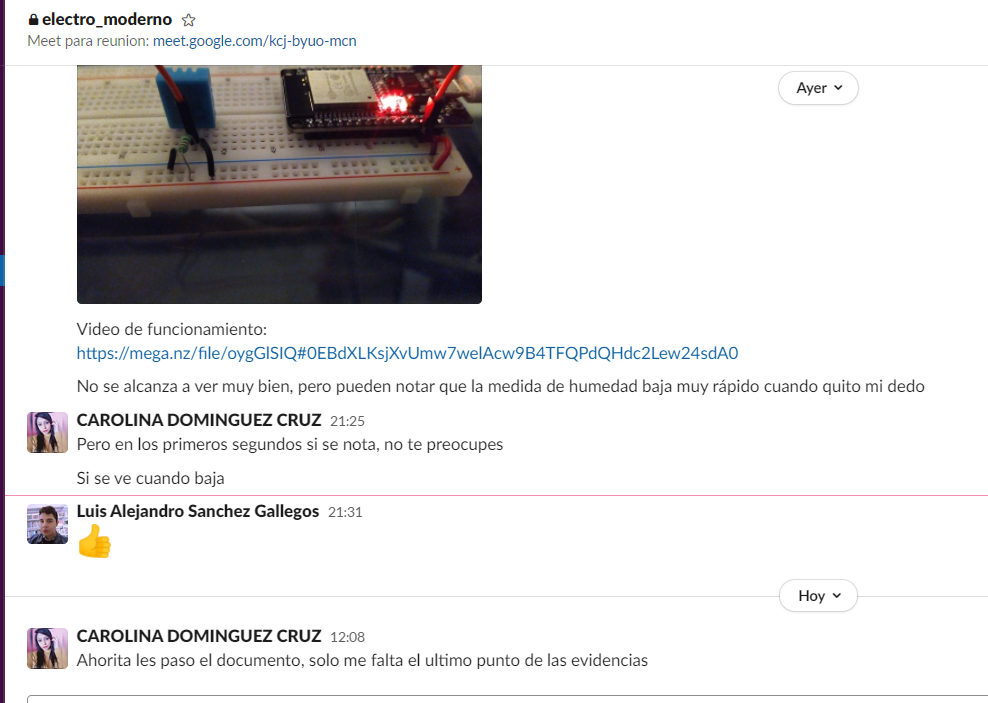

# :trophy: C5.1 Interface Node-RED y NodeMCU ESP32

Arquitectura Cliente-Servidor, utilizando interface Node-red, ESP32 y un sensor

___

## :blue_book: Instrucciones

- De acuerdo con la información presentada por el asesor referente al tema, desarrollar lo que se indica dentro del apartado siguiente.
- Toda actividad o reto se deberá realizar utilizando el estilo **MarkDown con extension .md** y el entorno de desarrollo VSCode, debiendo ser elaborado como un documento **single page**, es decir si el documento cuanta con imágenes, enlaces o cualquier documento externo debe ser accedido desde etiquetas y enlaces.
- Es requisito que el archivo .md contenga una etiqueta del enlace al repositorio de su documento en Github, por ejemplo **Enlace a mi GitHub**
- Al concluir el reto el reto se deberá subir a github el archivo .md creado.
- Desde el archivo **.md** se debe exportar un archivo **.pdf** con la nomenclatura **C5.1_NombreAlumno_Equipo.pdf**, el cual deberá subirse a classroom dentro de su apartado correspondiente, para que sirva como evidencia de su entrega; siendo esta plataforma **oficial** aquí se recibirá la calificación de su actividad por individual.
- Considerando que el archivo .pdf, fue obtenido desde archivo .md, ambos deben ser idénticos y mostrar el mismo contenido.
- Su repositorio ademas de que debe contar con un archivo **readme**.md dentro de su directorio raíz, con la información como datos del estudiante, equipo de trabajo, materia, carrera, datos del asesor, e incluso logotipo o imágenes, debe tener un apartado de contenidos o indice, los cuales realmente son ligas o **enlaces a sus documentos .md**, _evite utilizar texto_ para indicar enlaces internos o externo.
- Se propone una estructura tal como esta indicada abajo, sin embargo puede utilizarse cualquier otra que le apoye para organizar su repositorio.  


``` 
| readme.md
| | blog
| | | C5.1_TituloActividad.md
| | | C5.2_TituloActividad.md
| | img
| | docs
| | | A5.1_TituloActividad.md
| | | A5.2_TituloActividad.md
```
___

## :pencil2: Desarrollo

1. Basado en las actividades referentes a sensores, y protocolos de comunicación realice un Dashboard utilizando la interface Node-red y el NodeMCU ESP32; el cual permitirá a un cliente a través de su dispositivo movil acceder a una dirección de un servidor Web local, y al ingresar al sitio deberá observar un dashboard que visualice el comportamiento de un sensor en tiempo real.

2. Para poder observar que la interface muestra el comportamiento de un sensor deberá a este someterse a condiciones cambiantes a fin de observar esas variaciones en el dashboard.

3. Agregue el programa creado para lograr la condición solicitada.

* Código Arduino:
```C
#include <DHTesp.h>
#include <WiFi.h>
#include <WebServer.h>
const char* ssid = "Totalplay-2.4G-6b88";
const char* password = "WiDAUgMDVhaD6eSe";
WebServer server(80);
DHTesp dht;
const int SENSOR_PIN = 13;
TempAndHumidity reading;
void setup() {
	// Consola serial
	Serial.begin(115200);
	// Sensor
	dht.setup(SENSOR_PIN, DHTesp::DHT11);
	// Wi-Fi
	WiFi.begin(ssid, password);
	Serial.print("Trying to connect to ");
	Serial.print(ssid);
	while (WiFi.status() != WL_CONNECTED) {
		delay(1000);
		Serial.print(".");
	}
	Serial.println("");
	Serial.print("Connected! Go to ");
	Serial.println(WiFi.localIP());
	// HTTP server
	server.on("/", handle_root);
	server.begin();
	delay(100);
	Serial.println("Server active!");
}
void loop() {
	reading = dht.getTempAndHumidity();
	server.handleClient();
}
void handle_root() {
	server.send(200, "application/json", "{\"temperature\": " + String(reading.temperature) + ", \"humidity\": " + String(reading.humidity) + "}");
}
```

* Código del flujo:
```C
[{"id":"f6f2187d.f17ca8","type":"tab","label":"Flow 1","disabled":false,"info":""},{"id":"1eab1382.257944","type":"http request","z":"f6f2187d.f17ca8","name":"","method":"GET","ret":"obj","paytoqs":"ignore","url":"192.168.100.12","tls":"","persist":false,"proxy":"","authType":"","x":130,"y":80,"wires":[["a653acb.f79e35","e45c198c.745e98"]]},{"id":"cbe892eb.7e65e8","type":"inject","z":"f6f2187d.f17ca8","name":"Repeat request","props":[],"repeat":"0.25","crontab":"","once":false,"onceDelay":0.1,"topic":"","x":150,"y":40,"wires":[["1eab1382.257944"]]},{"id":"a653acb.f79e35","type":"change","z":"f6f2187d.f17ca8","name":"Temperature","rules":[{"t":"set","p":"payload","pt":"msg","to":"payload.temperature","tot":"msg"}],"action":"","property":"","from":"","to":"","reg":false,"x":290,"y":80,"wires":[["444f2d55.4b46d4"]]},{"id":"e45c198c.745e98","type":"change","z":"f6f2187d.f17ca8","name":"Humidity","rules":[{"t":"set","p":"payload","pt":"msg","to":"payload.humidity","tot":"msg"}],"action":"","property":"","from":"","to":"","reg":false,"x":280,"y":120,"wires":[["5231f59e.18fb64"]]},{"id":"444f2d55.4b46d4","type":"ui_gauge","z":"f6f2187d.f17ca8","name":"","group":"1147b14.8ca0e4f","order":1,"width":0,"height":0,"gtype":"gage","title":"Temperature","label":"ºC","format":"{{value}}","min":0,"max":"30","colors":["#00ffff","#ffffff","#ff0000"],"seg1":"","seg2":"","x":450,"y":80,"wires":[]},{"id":"5231f59e.18fb64","type":"ui_gauge","z":"f6f2187d.f17ca8","name":"","group":"1147b14.8ca0e4f","order":1,"width":0,"height":0,"gtype":"gage","title":"Humidity","label":"units","format":"{{value}}","min":0,"max":"50","colors":["#808080","#ffffff","#00ffff"],"seg1":"","seg2":"","x":440,"y":120,"wires":[]},{"id":"1147b14.8ca0e4f","type":"ui_group","name":"Sensors","tab":"f64f1fc.c41e06","order":1,"disp":true,"width":"6","collapse":false},{"id":"f64f1fc.c41e06","type":"ui_tab","name":"Sensors","icon":"dashboard","disabled":false,"hidden":false}]
```

4. Agregue imágenes del circuito electrónico ensamblado.








5. Inserte aqui el video de Demostracion
   
   #### **Video de demostracion:**
   [Explicacion](https://mega.nz/file/oygGlSIQ#0EBdXLKsjXvUmw7welAcw9B4TFQPdQHdc2Lew24sdA0)

6. Inserte aquí las imágenes que considere como evidencias para demostrar el resultado obtenido y las reuniones del equipo de trabajo.







___

### :bomb: Rubrica

| Criterios     | Descripción                                                                                  | Puntaje |
| ------------- | -------------------------------------------------------------------------------------------- | ------- |
| Instrucciones | Se cumple con cada uno de los puntos indicados dentro del apartado Instrucciones?            | 20 |
| Desarrollo    | Se respondió a cada uno de los puntos solicitados dentro del desarrollo de la actividad?     | 80      |

[:arrow_left: Volver al Índice](../README.md)

[:bookmark_tabs: Repositorio en GitHub](https://github.com/CarolinaDominguez18/SistemasProgramables)