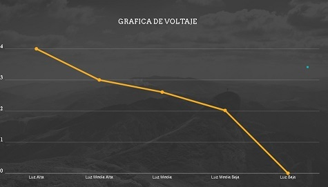
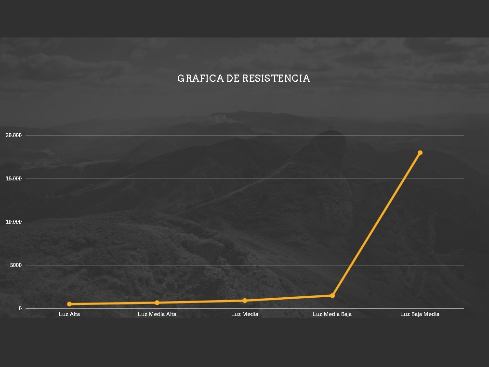
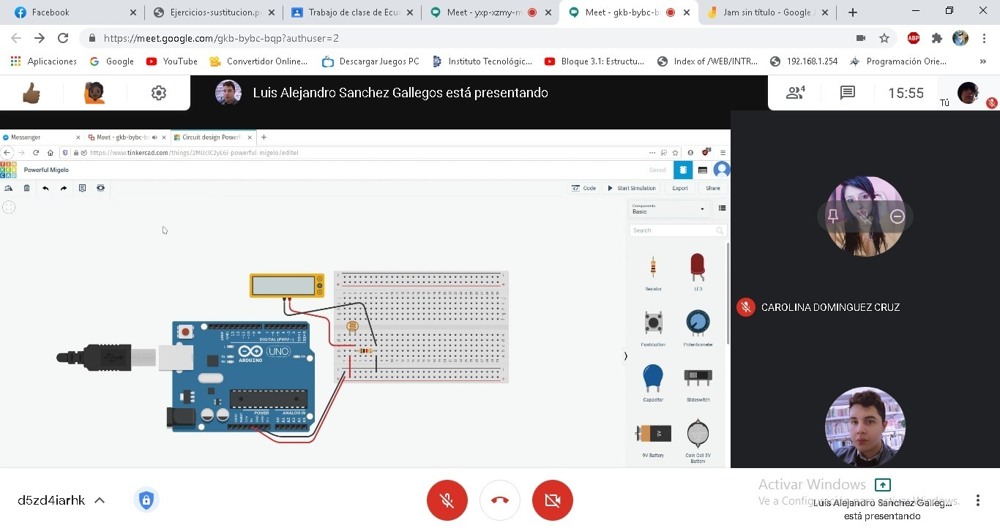
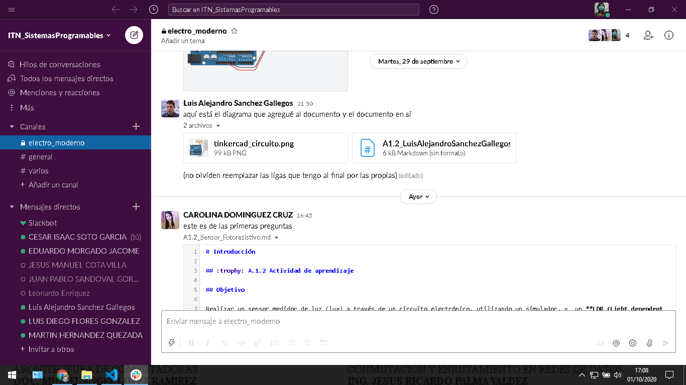
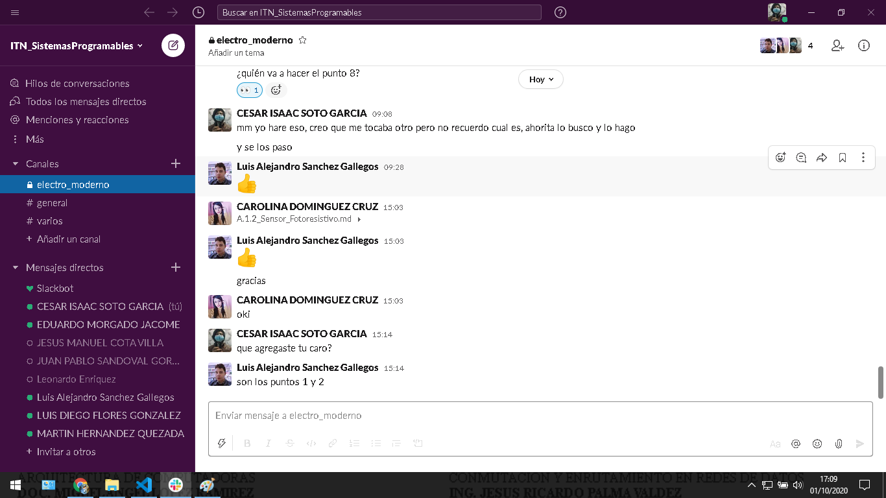
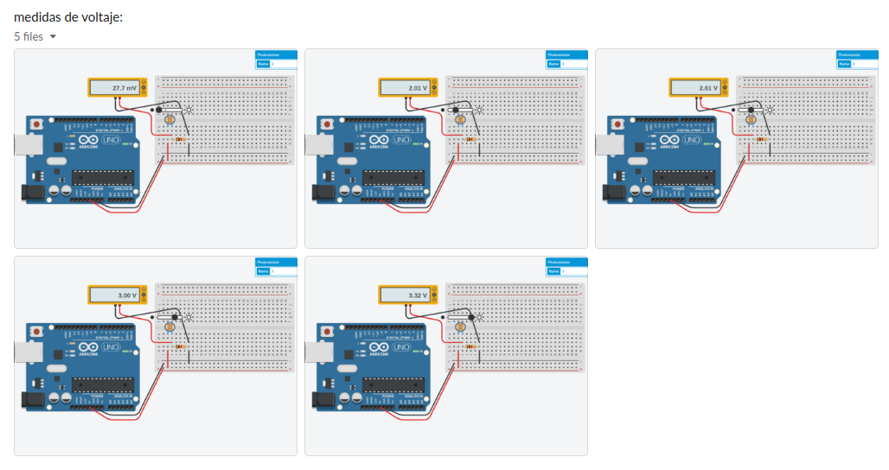
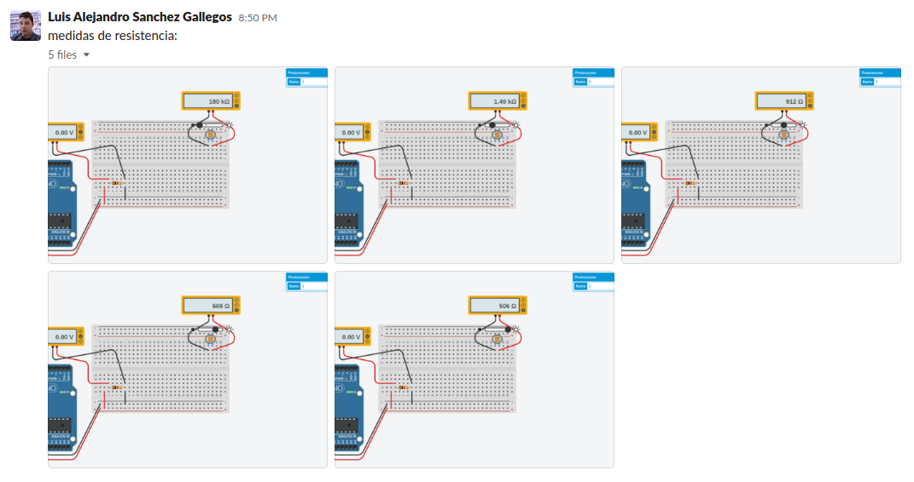

# Introducción

## :trophy: A.1.2 Actividad de aprendizaje

## Objetivo

Realizar un sensor medidor de luz (lux) a través de un circuito electrónico, utilizando un simulador, y  un **LDR (Light dependent Resistor)**.

### :blue_book: Instrucciones

- Se sugiere para el desarrollado de la presenta actividad, utilice uno de los siguientes simuladores: [Autodesk Tinkercad](https://www.tinkercad.com/), [Virtual BreadBoard](http://www.virtualbreadboard.com/), [Easy EDA](https://easyeda.com/) por lo cual habrá que familiarizarse antes, e incluso instalarse o registrarse dentro de la plataforma.
- Toda actividad o reto se deberá realizar, utilizando el estilo **MarkDown con extension .md** y el entorno de desarrollo VSCode, debiendo ser elaborado como un documento **single page**, es decir si el documento cuanta con imágenes, enlaces o cualquier documento externo debe ser accedido desde etiquetas y enlaces, y debe ser nombrado con la nomenclatura **A1.2_NombreApellido_Equipo.pdf.**
- Es requisito que el .MD contenga una etiqueta del enlace al repositorio de su documento en GITHUB, por ejemplo **Enlace a mi GitHub** y al concluir el reto se deberá subir a github.
- Desde el archivo **.md** exporte un archivo **.pdf** que deberá subirse a classroom dentro de su apartado correspondiente, sirviendo como evidencia de su entrega, ya que siendo la plataforma **oficial** aquí se recibirá la calificación de su actividad.
- Considerando que el archivo .PDF, el cual fue obtenido desde archivo .MD, ambos deben ser idénticos.
- Su repositorio ademas de que debe contar con un archivo **readme**.md dentro de su directorio raíz, con la información como datos del estudiante, equipo de trabajo, materia, carrera, datos del asesor, e incluso logotipo o imágenes, debe tener un apartado de contenidos o indice, los cuales realmente son ligas o **enlaces a sus documentos .md**, _evite utilizar texto_ para indicar enlaces internos o externo.
- Se propone una estructura tal como esta indicada abajo, sin embargo puede utilizarse cualquier otra que le apoye para organizar su repositorio.
  
```
- readme.md
  - blog
    - C0.1_x.md
    - C0.2_x.md
  - img
  - docs
    - A0.1_x.md
    - A0.2_x.md
    - A1.2_x.md
    - A1.3_x.md
```


### :pencil2: Desarrollo

1. Utilice el siguiente listado de materiales para la elaboración de la actividad y agregue en la columna Fuente de consulta su enlace _bibliográfico_.

    | Cantidad | Descripción                      | Fuente de consulta |
    | -------- | -------------------------------- | ------------------ |
    | 1        | Sensor Fotoresistencia LDR de 2M |[GeekBoTelectronics](http://www.geekbotelectronics.com/producto/fotoresistencia-gl5537-2mohm/)|
    | 1        | Resistencia 1k                   |[Electro Componentes](https://www.electrocomponentes.es/resistencias/resistencia-1k-ohm-025w-39-.html)|
    | 1        | Fuente de alimentación de 5v.    |[ShopDelta](https://shopdelta.eu/fuente-de-alimentacion-5v2a5-5_l6_p7952.html)|

---

2. Considerando que el elemento LDR es un sensor fotoresistivo es decir varia su resistencia en base a la cantidad de luz que incide sobre el, **Que observa en el grafico siguiente?** 
   


*Que si la luz solar es demasiado brillante, la resistencia sera menor, al contrario de que sea de noche, las resistencias se eleva, se nota mas la iluminacion durante la noche, que el dia. Porque la resistencia con luz, es de 1 k ohm, en cambio con oscuridad es de 10 k ohm*

---

3. Ensamble el circuito que se muestra utilizado el simulador que halla considerado, colocando la fotorresistencia en la posición LDR y resistencia de acuerdo con la imagen del esquemático:


---

4. coloque la imagen finalmente obtenida del circuito ensamblado dentro de su simulador.


---

5. Mida la **resistencia** de la fotorresistencia con el ohmetro bajo las siguientes condiciones: ausencia de luz u oscuridad,  luz ambiente, luz intensiva y registre en la tabla correspondiente.

---

6. Calcule el **valor de voltaje Vout teórico** para cada una de las condiciones antes indicadas asi como el valor de voltaje Vout medido  y registre en la tabla correspondiente.

---

7. Calcule el **valor de exactitud** de voltaje entre lo teórico y lo medido para cada condición  y registre en la tabla correspondiente.

   | Condicion       | Impedancia en fotoresistencia | Voltaje Vout teórico | Voltaje Vout medido | %  V.Medido/ V.Teórico |
    | --------------- | ----------------------------- | -------------------- | ------------------- | ---------------------- |
    | Ausencia de luz | 180,000 ohms                  | 0.0276 volts         | 0.0277 volts        | 100%                   |
    | Luz ambiental   | 912 ohms                      | 2.615 volts          | 2.61 volts          | 99.8%                  |
    | Luz intensa     | 506 ohms                      | 3.32 volts           | 3.32 volts          | 100%                   |

---

8. **Grafique** a través de los valores registrados en la tabla anterior de tal manera que se pueda observar el comportamiento de la curva del componente LDR e **inserte la grafica**.

***Comportamiento de voltaje del LDR***



***Comportamiento de Resistencia del LDR***


---

9. Inserte imágenes de **evidencias** tales como son reuniones  de los integrantes del equipo realizadas para el desarrollo de la actividad






---

10. Incluya las conclusiones individuales y resultados observados durante el desarrollo de la actividad.

**Carolina Dominguez Cruz**

Le tuve que pedir ayuda a mi compañero, porque ni me acordaba del como hacer un simulador de un circuito. Tuvimos que calcular el valor del voltaje, asi que nos reunimos por meet para realizarlos. Al describir la pregunta 2 me dio cuenta que los sensores LDR se aprecian mas durante la noche, la oscuridad. Porque la resistencia es 10 veces mayor que con luz

**Cesar Soto Garcia**

Fue un poco raro el manejar el simulador, considero que suena interesante el hecho de como se altera el voltaje y la impedancia del fotoresistor, creo que nunca habia observado uno y la funcion que esta tiene y hubo algo de complejidad para realizar el circuito pero al final se pudo solucionar.


**Luis Alejandro Sanchez Gallegos**

Una de las cosas más interesantes aprendidas en esta actividad es el comportamiento de los arreglos de resistencias sobre el voltaje de un circuito: inicialmente construimos el circuito utilizando un divisor de voltaje con un par de resistencias, tales que el voltaje de salida fuese 5 voltios, pero al pasar por la fotorresistencia el voltaje dado por el divisor de voltaje disminuyó aún más. Esto generó porcentajes de precisión increíblemente bajos, entre 74% y 78%, ya que no estábamos considerando el cambio de voltaje. Finalmente decidimos utilizar la salida de 5v de una placa Arduino como fuente de energía (aunque existen otras soluciones), lo cual generó porcentajes de precisión ideales, entre 99.8% y 100%. Así que además de la función de un fotorresistor, aprendí a tomar ciertas consideraciones a la hora de construir un circuito y encontrar problemas antes de que ocurran.

---

### :bomb: Rubrica

| Criterios     | Descripción                                                                                  | Puntaje |
| ------------- | -------------------------------------------------------------------------------------------- | ------- |
| Instrucciones | Se cumple con cada uno de los puntos indicados dentro del apartado Instrucciones?            | 10      |  | 5 |
| Desarrollo    | Se respondió a cada uno de los puntos solicitados dentro del desarrollo de la actividad?     | 60      |
| Demostración  | El alumno se presenta durante la explicación de la funcionalidad de la actividad?            | 20      |
| Conclusiones  | Se incluye una opinión personal de la actividad  por cada uno de los integrantes del equipo? | 10      |


[:arrow_left: Volver al Índice](../README.md)

[:bookmark_tabs: Repositorio en GitHub](https://github.com/CarolinaDominguez18/SistemasProgramables)
