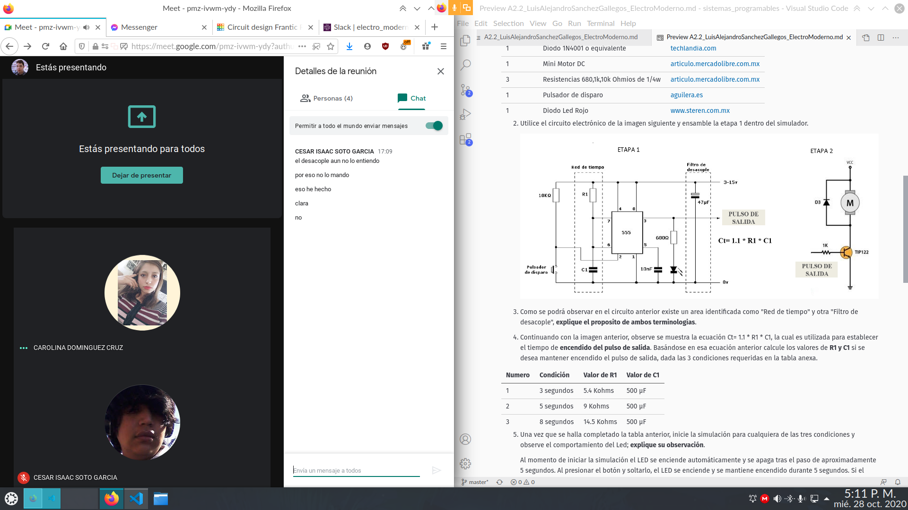
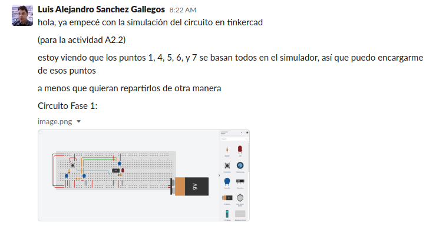
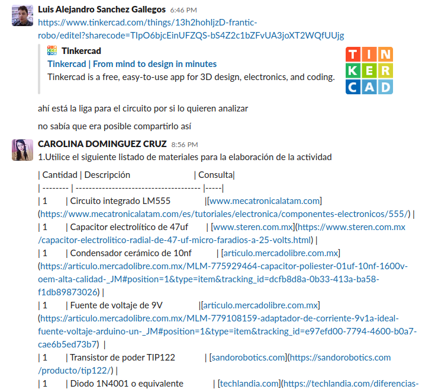

# Actuadores
​
# :trophy: A.2.2 Actividad de aprendizaje
​
 Realizar un sistema de control de arranque y encendido para un actuador eléctrico a través de un circuito electrónico, utilizando un simulador, un **Temporizador NE55s** y un **Motor de DC**.
​
​
### :blue_book: Instrucciones
​
- Se sugiere para el desarrollado de la presenta actividad, utilice uno de los siguientes simuladores: [Autodesk Tinkercad](https://www.tinkercad.com/), [Virtual BreadBoard](http://www.virtualbreadboard.com/), [Easy EDA](https://easyeda.com/) por lo cual habrá que familiarizarse antes, e incluso instalarse o registrarse dentro de la plataforma.
- Toda actividad o reto se deberá realizar utilizando el estilo **MarkDown con extension .md** y el entorno de desarrollo VSCode, debiendo ser elaborado como un documento **single page**, es decir si el documento cuanta con imágenes, enlaces o cualquier documento externo debe ser accedido desde etiquetas y enlaces, y debe ser nombrado con la nomenclatura **A2.2_NombreApellido_Equipo.pdf.**
- Es requisito que el .md contenga una etiqueta del enlace al repositorio de su documento en GITHUB, por ejemplo **Enlace a mi GitHub** y al concluir el reto se deberá subir a github.
- Desde el archivo **.md** exporte un archivo **.pdf** que deberá subirse a classroom dentro de su apartado correspondiente, sirviendo como evidencia de su entrega, ya que siendo la plataforma **oficial** aquí se recibirá la calificación de su actividad.
- Considerando que el archivo .PDF, el cual fue obtenido desde archivo .MD, ambos deben ser idénticos.
- Su repositorio ademas de que debe contar con un archivo **readme**.md dentro de su directorio raíz, con la información como datos del estudiante, equipo de trabajo, materia, carrera, datos del asesor, e incluso logotipo o imágenes, debe tener un apartado de contenidos o indice, los cuales realmente son ligas o **enlaces a sus documentos .md**, _evite utilizar texto_ para indicar enlaces internos o externo.
- Se propone una estructura tal como esta indicada abajo, sin embargo puede utilizarse cualquier otra que le apoye para organizar su repositorio.
  
```
- readme.md
  - blog
    - C2.1_x.md
    - C2.2_x.md
  - img
  - docs
    - A2.1_x.md
    - A2.2_x.md
```
### :pencil2: Desarrollo
​
1. Utilice el siguiente listado de materiales para la elaboración de la actividad
​

| Cantidad | Descripción                            | Consulta| 
| -------- | -------------------------------------- |-----| 
| 1        | Circuito integrado LM555               |[www.mecatronicalatam.com](https://www.mecatronicalatam.com/es/tutoriales/electronica/componentes-electronicos/555/) |
| 1        | Capacitor electrolítico de 47uf        | [www.steren.com.mx](https://www.steren.com.mx/capacitor-electrolitico-radial-de-47-uf-micro-faradios-a-25-volts.html) |
| 1        | Condensador cerámico de 10nf           | [articulo.mercadolibre.com.mx](https://articulo.mercadolibre.com.mx/MLM-775929464-capacitor-poliester-01uf-10nf-1600v-oem-alta-calidad-_JM#position=1&type=item&tracking_id=dcfb8d8a-0b33-413a-ba58-f1db89873026) |
| 1        | Fuente de voltaje de 9V                |[articulo.mercadolibre.com.mx](https://articulo.mercadolibre.com.mx/MLM-779108159-adaptador-de-corriente-9v1a-ideal-fuente-voltaje-arduino-un-_JM#position=1&type=item&tracking_id=e97efd00-7794-4600-b0a7-cae6b5ed73b7)  |
| 1        | Transistor de poder TIP122             | [sandorobotics.com](https://sandorobotics.com/producto/tip122/) |
| 1        | Diodo 1N4001 o equivalente             | [techlandia.com](https://techlandia.com/diferencias-diodo-1n4004-1n4001-info_580129/) |
| 1        | Mini Motor DC                          | [articulo.mercadolibre.com.mx](https://articulo.mercadolibre.com.mx/MLM-787017272-mini-motor-dc-3-a-6v-proyectos-electronica-arduino-10-piezas-_JM#position=1&type=item&tracking_id=4c7374f0-38ca-4d26-9e23-d7af4a4c248d) |
| 3        | Resistencias 680,1k,10k Ohmios de 1/4w | [articulo.mercadolibre.com.mx](https://articulo.mercadolibre.com.mx/MLM-660627026-200-resistencias-14-w-1-pelicula-metalica-varios-valores-_JM#position=1&type=item&tracking_id=e95993af-128a-4a77-90de-11df4cd650a4) |
| 1        | Pulsador de disparo                    |[aguilera.es](https://aguilera.es/?productos=pulsador-de-disparo-de-extincion)  |
| 1        | Diodo Led Rojo                         |[www.steren.com.mx](https://www.steren.com.mx/led-ultrabrillante-de-5-mm-color-rojo.html)  |

2. Utilice el circuito electrónico de la imagen siguiente y ensamble la etapa 1 dentro del simulador.
​

​
3. Como se podrá observar en el circuito anterior existe un area identificada como "Red de tiempo" y otra "Filtro de desacople", **explique el proposito de ambos terminologias**.
​

**Red de tiempo:** El propósito de estos componentes es permitir que el motor
pueda configurarse en funcion de condiciones esperadas para que el motor gire
durante cierta cantidad de tiempo. La parte que está enmarcada en el circuito
sirve para realizar esta configuración, la cual funciona como temporizador para
el motor, y así hacer que gire durante un cierto periodo de tiempo.
​

**Filtro de desacople:** La finalidad del este fragmento del circuito es de
evitar y/o identificar una posible avería dentro del circuito. El capacitor que
se agrega para evitar que el motor gire de forma inversa al descargarse, lo
cual podria generar una avería en el circuito. Tambien cabe mencionar que el
area enmarcada en el circuito sirve para hacer tierra y dejar fluir la
corriente para que el motor gire.
​
1. Continuando con la imagen anterior, observe se muestra la ecuación Ct= 1.1 * R1 * C1, la cual es utilizada para establecer el tiempo de **encendido del pulso de salida**. Basándose en esa ecuación anterior calcule los valores de **R1 y C1** si se desea mantener encendido el pulso de salida, dada las 3 condiciones requeridas en la tabla anexa.
​

 | Numero | Condición  | Valor de R1 | Valor de C1 |
 | ------ | ---------- | ----------- | ----------- |
 | 1      | 3 segundos | 5.4 Kohms   | 500 µF      |
 | 2      | 5 segundos | 9 Kohms     | 500 µF      |
 | 3      | 8 segundos | 14.5 Kohms  | 500 µF      |
​

5. Una vez que se halla completado la tabla anterior, inicie la simulación para cualquiera de las tres condiciones y observe el comportamiento del Led;  **explique su observación**.
​
	Al momento de iniciar la simulación el LED se enciende automáticamente y se
	apaga tras el paso de aproximadamente 5 segundos. Al presionar el botón y
	soltarlo, el LED se enciende y se mantiene encendido durante 5 segundos. Si
	el botón se mantiene presionado más de 5 segundos, el LED se queda
	encendido hasta que se suelte el botón.
​

6. Ensamble la etapa 2 e integre la terminal del pulso de salida a la entrada de la base del transistor de esta segunda etapa.
​
7. Una vez concluido el paso anterior, elija una de las 3 condiciones registradas en la tabla anterior y observe el comportamiento del motor DC; **explique su observación**.
​
	El motor DC tiene exactamente el mismo comportamiento que el LED: se
	enciende por el tiempo dado por la red de tiempo al iniciar la simulación y
	al presionar el botón.
​
8. Una vez que el tiempo de encendido del pulso de salida de la etapa 1 se completó, **¿qué sucede con el motor DC? Explique la razon de este comportamiento?**
​

	Al completar el temporizador el motor DC se apaga. Esto es debido a que el
	polo negativo del motor DC está conectado al colector de un transistor NPN
	cuyo emisor lleva a tierra, y en la base del transistor se encuentra el
	pulso de salida del temporizador. Así que, mientras el temporizador esté
	activo, el transistor conecta al motor a tierra, cerrando el circuito y
	permitiendo el flujo de electricidad.
​
9. Inserte imágenes de **evidencias** tales como son reuniones de los integrantes del equipo realizadas para el desarrollo de la actividad
​
	
	
	
	
​
10. Incluya las conclusiones individuales y resultados observados durante el desarrollo de la actividad.
​
	- **Carolina Dominguez Cruz:** En esta practica se simulo y se dividió en 2
	partes para encender el led, a travez de un motor, dentro del circuito.
	La terminal va a travez de un capacitor de 10 kf. Para poder funcionar
	correctamente el motor esta conectado al transistor y solo lo lleva a
	tierra. Mientras el capacitador pequeño tiene que ser una resistencia alta,
	para su funcionamiento.
	
	- **Cesar Isaac Soto García:** En conclusion con la actividad aprendi a
	como se usa un minimotor dc y como hacer que gire durante una cantidad de
	tiempo, y como evitar que se sobrecaliente, y al analizarlo tambien me di
	cuenta que sin el capacitor agregado al circuito el motor giraria de
	forma inversa este giraria de forma brusca y podria averiarse.
	
	- **Luis Alejandro Sanchez Gallegos:** Me parece interesante que
	componentes eléctricos como estos existan. En mi experiencia previa con
	electrónica simplemente se utilizaban sistemas computarizados como
	microprocesadores para controlar tiempo, gracias al reloj constante que la
	mayoría de las computadoras tienen. Sin embargo, este temporizador es una
	solución más barata, utilizando solamente resistencias internas para
	generar una medida de tiempo. Gran parte de la fabricación de dispositivos
	electrónicos es la rentabilidad, y este componente es una solución mucho
	más rentable y práctica que utilizar un microprocesador con un reloj de
	cuarzo, dado que un simple temporizador sea la única funcionalidad
	requerida.
​
### :bomb: Rubrica
​
| Criterios     | Descripción                                                                                  | Puntaje |
| ------------- | -------------------------------------------------------------------------------------------- | ------- |
| Instrucciones | Se cumple con cada uno de los puntos indicados dentro del apartado Instrucciones?            | 10      |
| Desarrollo    | Se respondió a cada uno de los puntos solicitados dentro del desarrollo de la actividad?     | 60      |
| Demostración  | El alumno se presenta durante la explicación de la funcionalidad de la actividad?            | 20      |
| Conclusiones  | Se incluye una opinión personal de la actividad  por cada uno de los integrantes del equipo? | 10      |
​
​
[:arrow_left: Volver al Índice](../README.md)
​

[:bookmark_tabs: Repositorio en GitHub de Carolina Dominguez Cruz](https://github.com/CarolinaDominguez18/SistemasProgramables)
​

[:bookmark_tabs: Repositorio en GitHub de Cesar Soto García](https://github.com/cesarsoto2/CesarSotoRepost)
​

[:bookmark_tabs: Repositorio en GitHub Luis Alejandro Sanchez Gallegos](https://github.com/alex-gallegos-tec/sistemas-programables)
