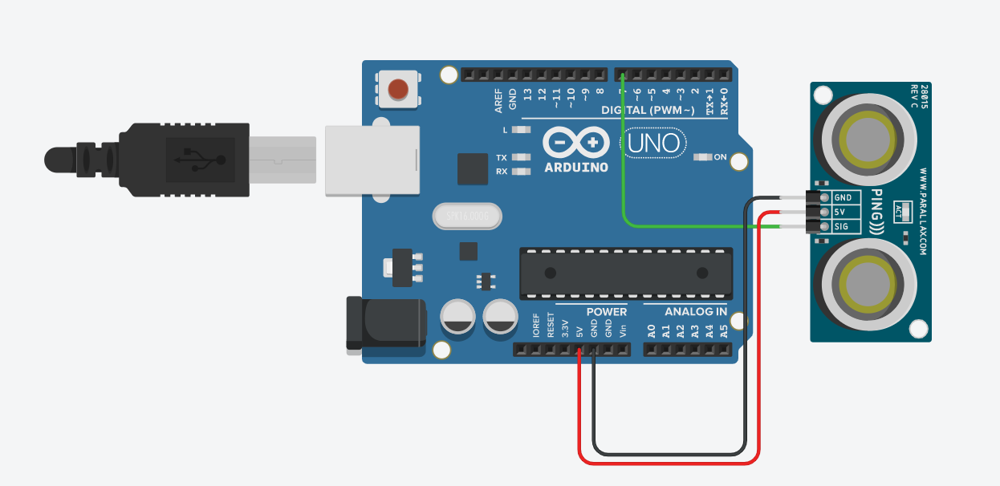
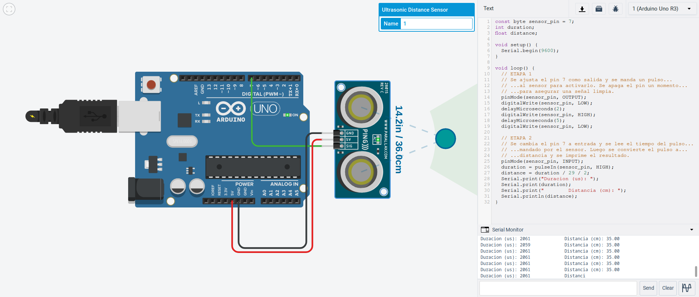
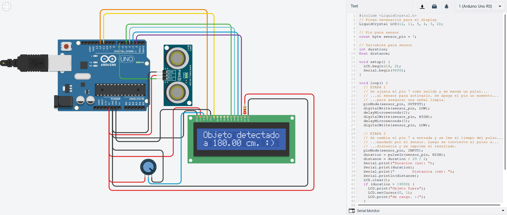
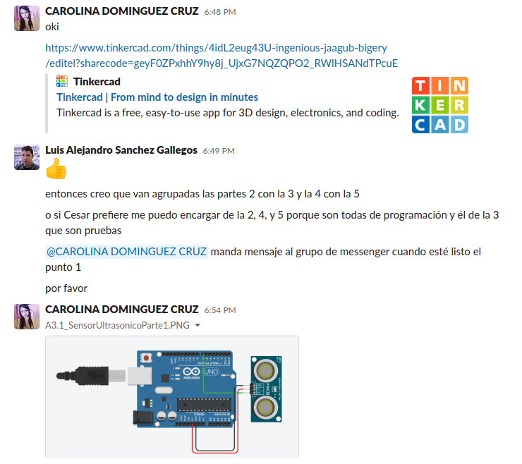
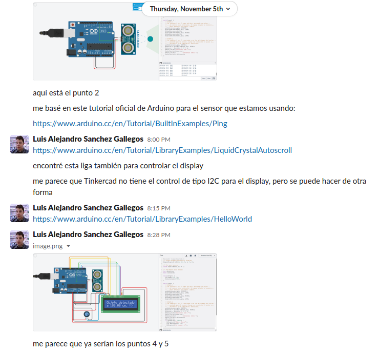
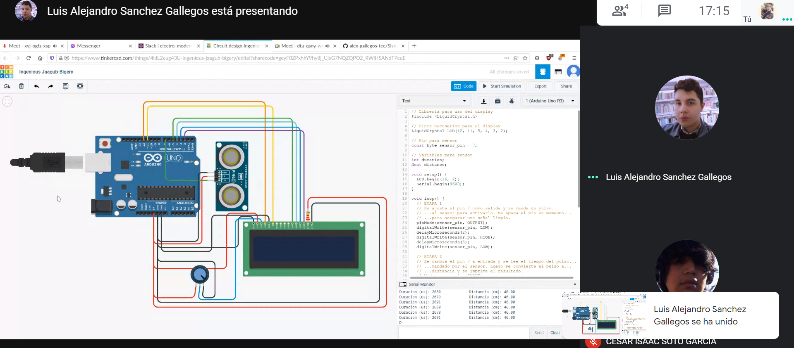

# :trophy: A.3.1 Actividad de aprendizaje

Circuito sensor de detección de objetos, utilizando un Arduino, un sensor ultrasonico y un Display I2C LCD 16x2.
___

## Instrucciones

* Realizar un sistema simulado, capaz de detectar la presencia y/o ausencia de un objeto, a través de un circuito electrónico, utilizando un Arduino, y un **Sensor Ultrasonico HC-SR04**.
* Toda actividad o reto se deberá realizar utilizando el estilo **MarkDown con extension .md** y el entorno de desarrollo VSCode, debiendo ser elaborado como un documento **single page**, es decir si el documento cuanta con imágenes, enlaces o cualquier documento externo debe ser accedido desde etiquetas y enlaces, y debe ser nombrado con la nomenclatura **A3.1_NombreApellido_Equipo.pdf.**
* Es requisito que el .md contenga una etiqueta del enlace al repositorio de su documento en GITHUB, por ejemplo **Enlace a mi GitHub** y al concluir el reto se deberá subir a github.
* Desde el archivo **.md** exporte un archivo **.pdf** que deberá subirse a classroom dentro de su apartado correspondiente, sirviendo como evidencia de su entrega, ya que siendo la plataforma **oficial** aquí se recibirá la calificación de su actividad.
* Considerando que el archivo .PDF, el cual fue obtenido desde archivo .MD, ambos deben ser idénticos.
* Su repositorio ademas de que debe contar con un archivo **readme**.md dentro de su directorio raíz, con la información como datos del estudiante, equipo de trabajo, materia, carrera, datos del asesor, e incluso logotipo o imágenes, debe tener un apartado de contenidos o indice, los cuales realmente son ligas o **enlaces a sus documentos .md**, _evite utilizar texto_ para indicar enlaces internos o externo.
* Se propone una estructura tal como esta indicada abajo, sin embargo puede utilizarse cualquier otra que le apoye para organizar su repositorio.
  
```
* readme.md
  - blog
    - C3.1_TituloActividad.md
    - C3.2_TituloActividad.md
    - C3.3_TituloActividad.md
    - C3.4_TituloActividad.md
    - C3.5_TituloActividad.md
    - C3.6_TituloActividad.md
    - C3.7_TituloActividad.md
    - C3.8_TituloActividad.md
  - img
  - docs
    - A3.1_TituloActividad.md
    - A3.2_TituloActividad.md
    - A3.3_TituloActividad.md
```
___

## Desarrollo

1. Utilizar el siguiente listado de materiales para la elaboración de la actividad

| Cantidad | Descripción |
| -------- | ------------|
| 1        | [Sensor Ultrasonico HC-SR04](https://www.amazon.com.mx/SainSmart-HC-SR04-Ranging-Detector-Distance/dp/B004U8TOE6/ref=sr_1_5?__mk_es_MX=%C3%85M%C3%85%C5%BD%C3%95%C3%91&dchild=1&keywords=hc-sr04&qid=1599005012&sr=8-5)            |
| 1         |[Display LCD de 16x2](https://www.steren.com.mx/display-lcd-2x16.html)|
| 1        | [Fuente de voltaje de 5V](https://cdmxelectronica.com/producto/fuente-de-alimentacion-5v-10a/)  |
| 1        | [1 Potenciómetro 10k ](https://www.amazon.com.mx/Uxcell-a15011600ux0235-Linear-Rotary-Potentiometer/dp/B01DKCUVMQ/ref=sr_1_1?__mk_es_MX=%C3%85M%C3%85%C5%BD%C3%95%C3%91&dchild=1&keywords=potenciometro+10k&qid=1599005041&sr=8-1) |
| 1        | [Arduino UNO](https://www.amazon.com.mx/Progressive-Automations-LC-066-Arduino-Rev3/dp/B00WH5XOJK/ref=sr_1_7?__mk_es_MX=%C3%85M%C3%85%C5%BD%C3%95%C3%91&dchild=1&keywords=arduino+uno&qid=1599005073&sr=8-7) |

2. Basado en la imágen que se muestra, ensamble dentro del simulador a utilizar, el circuito electrónico indicado en la **Figura 1**.




​
3. Realice el programa que permita a través de una de las entradas del Arduino, recibir el valor que registra el **Sensor Ultrasonico** al acercarse un objeto a distintas distancias.
​


​
4. Considerando que el sensor ultrasonico tiene un rango mínimo y máximo de detección basado en el tiempo de retorno de la señal sonica, que valores se obtienen en la simulación bajo las **siguientes condiciones:**
​
	**Nota: Esta actividad se hizo con el sensor ultrasónico PING))) en lugar
	del HC-SR04.**
​
 | Numero | Condición 1                   | Condición2                                 | El objeto es detectado?   |
 | ------ | ----------------------------- | ------------------------------------------ | ------------------------- |
 | 1      | 5 cm de distancia al sensor   | 0 grados al eje perpendicular del sensor   | El objeto es detectado    |
 | 2      | 50 cm de distancia al sensor  | 35 grados al eje perpendicular del sensor  | El objeto no es detectado |
 | 3      | 100 cm de distancia al sensor | -35 grados al eje perpendicular del sensor | El objeto no es detectado |
 | 4      | 5 cm de distancia al sensor   | 90 grados al eje perpendicular del sensor  | El objeto no es detectado |
 | 5      | 50 cm de distancia al sensor  | -60 grados al eje perpendicular del sensor | El objeto no es detectado |
 | 6      | 350 cm de distancia al sensor | 0 grados al eje perpendicular del sensor   | El objeto no es detectado |
​
5. Una vez completados los puntos anteriores, agregue a la Figura 1, **un Display I2C 16x2 LCD**, y coloque la imagen del circuito completado hasta este apartado.
​


​

6. Al haber completado la integración del Display I2C, ajuste el programa que le permita a través del display mostrar el siguiente mensaje, **"Objetivo detectado a ? cm** , y en caso de no lograr la detección indicar el mensaje **"Objetivo fuera de rango"**
​
	```c
	// Librería para uso del display
	#include <LiquidCrystal.h>
​

	// Pines necesarios para el display
	LiquidCrystal LCD(12, 11, 5, 4, 3, 2);
​

	// Pin para sensor
	const byte sensor_pin = 7;
​

	// Variables para sensor
	int duration;
	float distance;
​

	void setup() {
		LCD.begin(16, 2);
		Serial.begin(9600);
	}
​

	void loop() {
		// ETAPA 1
		// Se ajusta el pin 7 como salida y se manda un pulso...
		// ...al sensor para activarlo. Se apaga el pin un momento...
		// ...para asegurar una señal limpia.
		pinMode(sensor_pin, OUTPUT);
		digitalWrite(sensor_pin, LOW);
		delayMicroseconds(2);
		digitalWrite(sensor_pin, HIGH);
		delayMicroseconds(5);
		digitalWrite(sensor_pin, LOW);
		
		// ETAPA 2
		// Se cambia el pin 7 a entrada y se lee el tiempo del pulso...
		// ...mandado por el sensor. Luego se convierte el pulso a...
		// ...distancia y se imprime el resultado.
		pinMode(sensor_pin, INPUT);
		duration = pulseIn(sensor_pin, HIGH);
		distance = duration / 29 / 2;
		Serial.print("Duracion (us): ");
		Serial.print(duration);
		Serial.print("		Distancia (cm): ");
		Serial.println(distance);
		LCD.clear();
		if (duration > 19000) {
			LCD.print("Objeto fuera");
			LCD.setCursor(0, 1);
			LCD.print("de rango. :(");
		}
		else {
			LCD.print("Objeto detectado");
			LCD.setCursor(0, 1);
			LCD.print("a ");
			LCD.print(distance);
			LCD.print(" cm. :)");
		}
	}
	```
​
7. Coloque aqui evidencias que considere importantes durante el desarrollo de la actividad.
​




​
8. Incluya las conclusiones individuales y resultados observados durante el desarrollo de la actividad.
​
- **Carolina Dominguez Cruz:**
   La primera parte del circuito, es la
	conexion del sensor al arduino Ultrasonico. Lo utilizamos para detectar
	objetos en que pasan dentro de su rango. Nuestra segunda parte es colocar
	el potenciometro y LDC para poder presentar el mensaje o aviso. Que ambos
	componentes estaran conectados al arduino. Se codifica la distancia del
	objeto, duracion. Tambien se codifica al LDC un if else, para que en caso
	de que el objeto este fuera de rango(del area del sensor), muestre el
	mensaje de "Objeto fuera de rango", y lo contrario cuando este dentro del
	rango.
	
- **Cesar Isaac Soto García:** En esta actividad aprendi a utilizar el
	sensor ultrasonico en el simulador, y tambien el alcance que este sensor
	tiene, y el como medir la posicion del objeto y el como trabaja el sensor,
	mas que nada el como mandar y recibir datos en un  Display y el como se
	realiza la conexion, tambien un poco mas en lo personal aprendi a
	programar un poco mas en el arduino puesto que no conozco mucho de el aun.
	
- **Luis Alejandro Sanchez Gallegos:** El sensor utilizado en esta práctica
	no devuelve ninguna información de manera concisa: no tiene una escala
	predefinida y no utiliza in protocolo de comunicación o algo similar. El
	sensor simplemente utiliza un pulso de electricidad. Sin embargo, la placa
	Arduino es capaz de registrar este pulso y transformarlo en información
	útil para nosotros con un simple cálculo matemático. De igual manera, el
	display LCD trabaja con registros de memoria individuales a los cuales se
	debe transmitir información de manera manual. Sin embargo, existe una
	librería de código para transmitir información a este display de manera
	sencilla. **En cierta manera la placa Arduino parece ser un puente que
	comunica a dos diferentes dispositivos que hablan idiomas diferentes, o,
	vaya, no hablan realmente ningún idioma.**
___
​
### :bomb: Rubrica
​
| Criterios     | Descripción                                                                                  | Puntaje |
| ------------- | -------------------------------------------------------------------------------------------- | ------- |
| Instrucciones | Se cumple con cada uno de los puntos indicados dentro del apartado Instrucciones?            | 10      |
| Desarrollo    | Se respondió a cada uno de los puntos solicitados dentro del desarrollo de la actividad?     | 60      |
| Demostración  | El alumno se presenta durante la explicación de la funcionalidad de la actividad?            | 20      |
| Conclusiones  | Se incluye una opinión personal de la actividad  por cada uno de los integrantes del equipo? | 10      |
​

[:arrow_left: Volver al Índice](../README.md)
​

[:bookmark_tabs: Repositorio en GitHub de Carolina Dominguez Cruz](https://github.com/CarolinaDominguez18/SistemasProgramables)
​

[:bookmark_tabs: Repositorio en GitHub de Cesar Soto García](https://github.com/cesarsoto2/CesarSotoRepost)
​

[:bookmark_tabs: Repositorio en GitHub Luis Alejandro Sanchez Gallegos](https://github.com/alex-gallegos-tec/sistemas-programables)