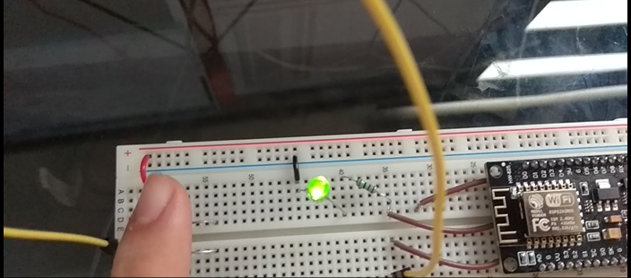
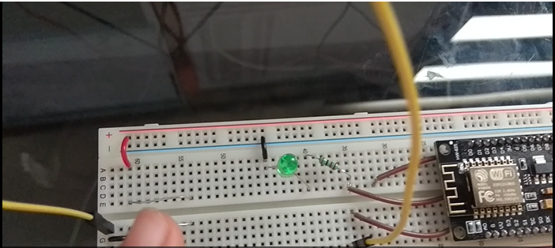
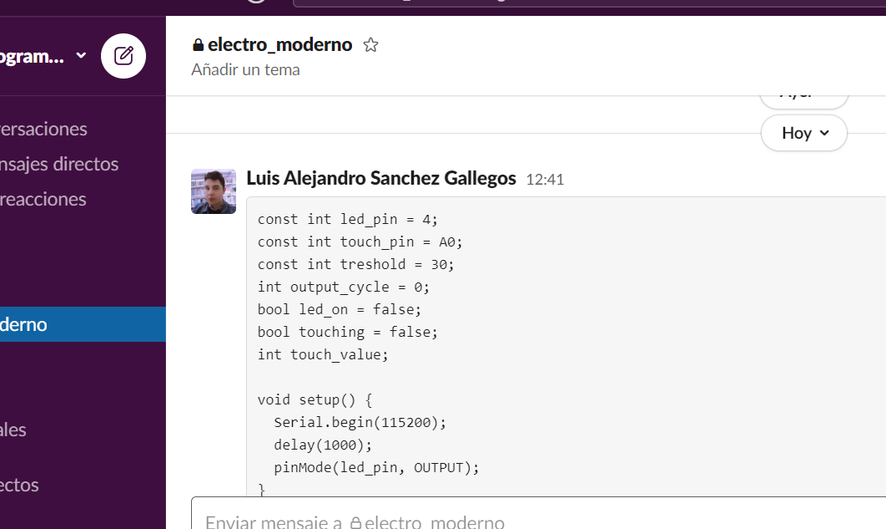
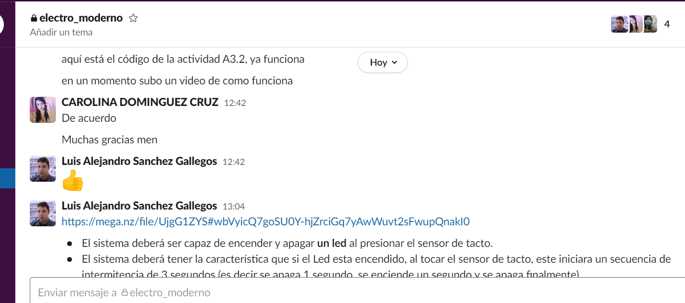
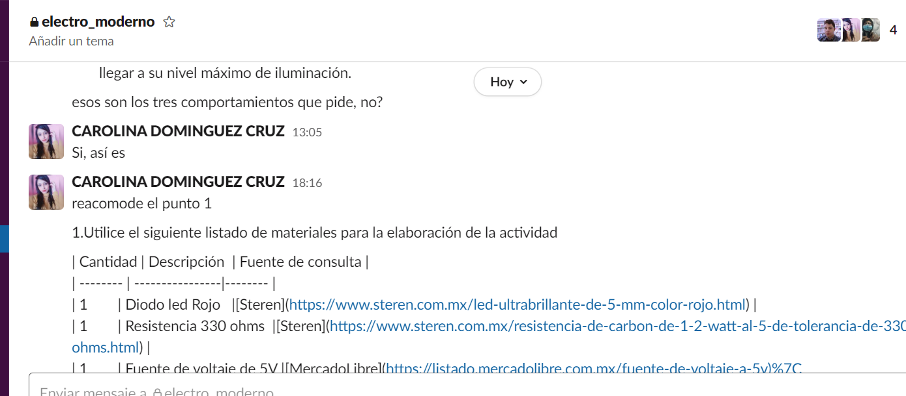
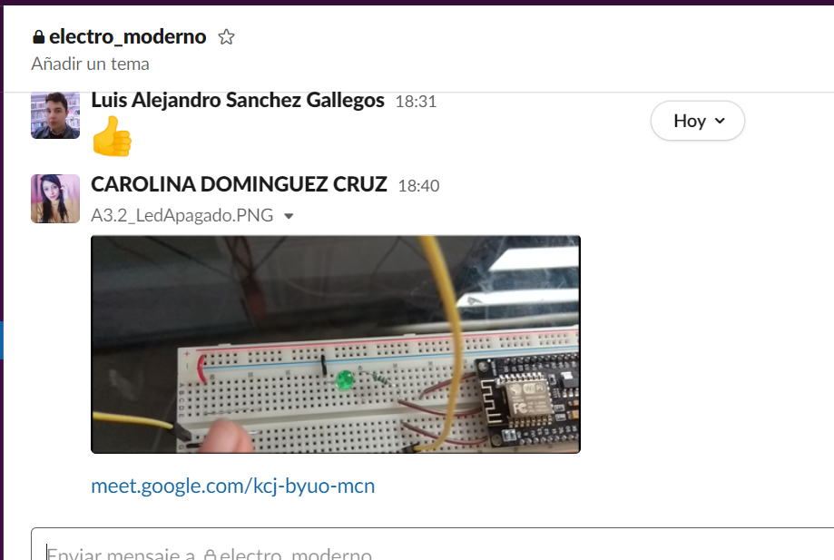
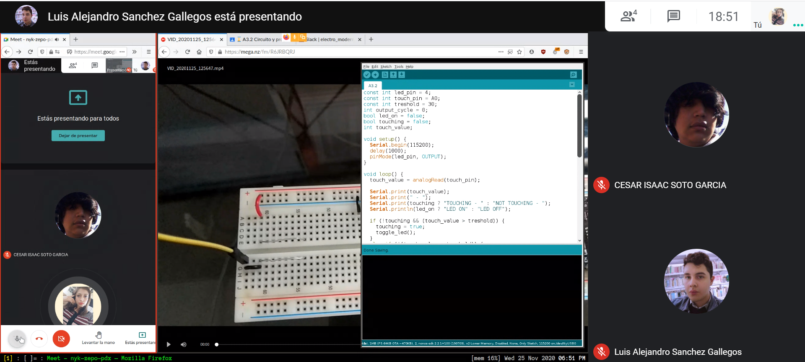

# :trophy: A.3.2 Actividad de aprendizaje

Circuito sensor de tacto a través de un NodeMCU ESP32
___

## Instrucciones

- Basado en la figura 1, ensamblar un sistema, capaz de responder al tacto, a través de un circuito electrónico, utilizando un NodeMCU **ESP32**, un  **Sensor de tacto capacitivo**.
- Toda actividad o reto se deberá realizar utilizando el estilo **MarkDown con extension .md** y el entorno de desarrollo VSCode, debiendo ser elaborado como un documento **single page**, es decir si el documento cuanta con imágenes, enlaces o cualquier documento externo debe ser accedido desde etiquetas y enlaces, y debe ser nombrado con la nomenclatura **A3.2_NombreApellido_Equipo.pdf.**
- Es requisito que el .md contenga una etiqueta del enlace al repositorio de su documento en GITHUB, por ejemplo **Enlace a mi GitHub** y al concluir el reto se deberá subir a github.
- Desde el archivo **.md** exporte un archivo **.pdf** que deberá subirse a classroom dentro de su apartado correspondiente, sirviendo como evidencia de su entrega, ya que siendo la plataforma **oficial** aquí se recibirá la calificación de su actividad.
- Considerando que el archivo .PDF, el cual fue obtenido desde archivo .MD, ambos deben ser idénticos.
- Su repositorio ademas de que debe contar con un archivo **readme**.md dentro de su directorio raíz, con la información como datos del estudiante, equipo de trabajo, materia, carrera, datos del asesor, e incluso logotipo o imágenes, debe tener un apartado de contenidos o indice, los cuales realmente son ligas o **enlaces a sus documentos .md**, _evite utilizar texto_ para indicar enlaces internos o externo.
- Se propone una estructura tal como esta indicada abajo, sin embargo puede utilizarse cualquier otra que le apoye para organizar su repositorio.
  
```
- readme.md
  - blog
    - C3.1_TituloActividad.md
    - C3.2_TituloActividad.md
    - C3.3_TituloActividad.md
    - C3.4_TituloActividad.md
    - C3.5_TituloActividad.md
    - C3.6_TituloActividad.md
    - C3.7_TituloActividad.md
    - C3.8_TituloActividad.md
  - img
  - docs
    - A3.1_TituloActividad.md
    - A3.2_TituloActividad.md
    - A3.3_TituloActividad.md
```
___

### Fuentes de apoyo para desarrollar la actividad

- [x] [Sensor de tacto capacitivo](https://randomnerdtutorials.com/esp32-touch-pins-arduino-ide/)
- [x] [Salida analogica PWM](https://randomnerdtutorials.com/esp32-pwm-arduino-ide/)

___

## Desarrollo

1.Utilice el siguiente listado de materiales para la elaboración de la actividad

| Cantidad | Descripción  | Fuente de consulta |
| -------- | ----------------|-------- |
| 1        | Diodo led Rojo   |[Steren](https://www.steren.com.mx/led-ultrabrillante-de-5-mm-color-rojo.html) |
| 1        | Resistencia 330 ohms  |[Steren](https://www.steren.com.mx/resistencia-de-carbon-de-1-2-watt-al-5-de-tolerancia-de-330-ohms.html) |
| 1        | Fuente de voltaje de 5V |[MercadoLibre](https://listado.mercadolibre.com.mx/fuente-de-voltaje-a-5v)|
| 1        | NodeMCU ESP32|[Amazon](https://www.amazon.com.mx/ESP-32-ESP-32S-ESP-WROOM-32-ESP32-S-desarrollo/dp/B07TBFC75Z/ref=sr_1_2?__mk_es_MX=%C3%85M%C3%85%C5%BD%C3%95%C3%91&dchild=1&keywords=esp32&qid=1599003438&sr=8-2)           |
| 1        | BreadBoard   |[Amazon](https://www.amazon.com.mx/Deke-Home-Breadboard-distribuci%C3%B3n-electr%C3%B3nica/dp/B086C9HK7V/ref=sr_1_22?__mk_es_MX=%C3%85M%C3%85%C5%BD%C3%95%C3%91&dchild=1&keywords=breadboard&qid=1599003455&sr=8-22) |
| 1        | Jumpers M/M| [Amazon](https://www.amazon.com.mx/ELEGOO-Macho-Hembra-Macho-Macho-Hembra-Hembra-Protoboard/dp/B06ZXSQ5WG/ref=sr_1_1?__mk_es_MX=%C3%85M%C3%85%C5%BD%C3%95%C3%91&dchild=1&keywords=jumper+wires&qid=1599003519&sr=8-1) |
| 1        | Hoja de aluminio  |                                                                                                                                      


2. Una vez ensamblado el circuito anterior, realice un programa que permita al ensamble cumplir con las siguientes condiciones:
    - El sistema deberá ser capaz de encender y apagar **un led** al presionar el sensor de tacto.
    - El sistema deberá tener la característica que si el Led esta encendido, al tocar el sensor de tacto, este iniciara un secuencia de intermitencia de 3 segundos (es decir se apaga 1 segundo, se enciende un segundo y se apaga finalmente).
    - El sistema deberá contar con la característica que si el Led esta apagado, al tocar el sensor de tacto, este se encenderá poco a poco hasta llegar a su nivel máximo de iluminación.
3. Coloque aquí evidencias que considere importantes durante el desarrollo de la actividad.

# **Video de demostracion:**
 [Explicacion](
https://mega.nz/file/UjgG1ZYS#wbVyicQ7goSU0Y-hjZrciGq7yAwWuvt2sFwupQnakI0)

# **Practica:**





## **Reunion:**







4. Conclusiones Individuales

- **Carolina Dominguez Cruz:**
  En la parte del circuito tocaremos el par de cables pelados en vez del sensor de tacto por tener un ESP distinto, para que encienda el Led y asi mismo para que se apague. Pero cuando lo tocamos nuevamente el led estara a su maxima iluminacion, su luz intermitente. En cuanto a la programacion o codigo al momento de tocar los cables, marcara  LED ON, cuando este encendido y LED OFF cuando este apagado.

- **Cesar Isaac Soto García:**
  En esta actividad se aprendio lo que se vio en las actividades anteriores, lo del configurar el sensor touch, fue interesante el funciona y se configura el sensor touch y el led para que este encienda de poco a poco los leds. El entorno de desarrollo arduino es algo sencillo de trabajar ya que se parece mucho a lo que hemos trabajado y no se complica tanto. La actividad en lo personal esta muy clara con lo que se pide.
  
- **Luis Alejandro Sanchez Gallegos:** 
 Creo que esta actividad marca muy claramente una de las ventajas del uso de los microcontroladores en la electrónica: el hecho de que son programables a través de un lenguaje de programación imperativo (en este caso C). La programación imperativa nos da la facilidad de decirle al microcontrolador exactamente lo que queremos que haga, permitiendo crear comportamientos complejos y dinámicos que serían muy difíciles de implementar con solamente componentes electrónicos.
  
___

### :bomb: Rubrica

| Criterios     | Descripción                                                                                  | Puntaje |
| ------------- | -------------------------------------------------------------------------------------------- | ------- |
| Instrucciones | Se cumple con cada uno de los puntos indicados dentro del apartado Instrucciones?            | 10      |
| Desarrollo    | Se respondió a cada uno de los puntos solicitados dentro del desarrollo de la actividad?     | 60      |
| Demostración  | El alumno se presenta durante la explicación de la funcionalidad de la actividad?            | 20      |
| Conclusiones  | Se incluye una opinión personal de la actividad  por cada uno de los integrantes del equipo? | 10      |

[:arrow_left: Volver al Índice](../README.md)
​

[:bookmark_tabs: Repositorio en GitHub de Carolina Dominguez Cruz](https://github.com/CarolinaDominguez18/SistemasProgramables)
​

[:bookmark_tabs: Repositorio en GitHub de Cesar Soto García](https://github.com/cesarsoto2/CesarSotoRepost)
​

[:bookmark_tabs: Repositorio en GitHub Luis Alejandro Sanchez Gallegos](https://github.com/alex-gallegos-tec/sistemas-programables)