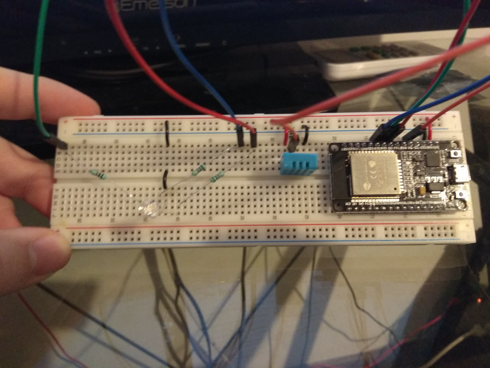
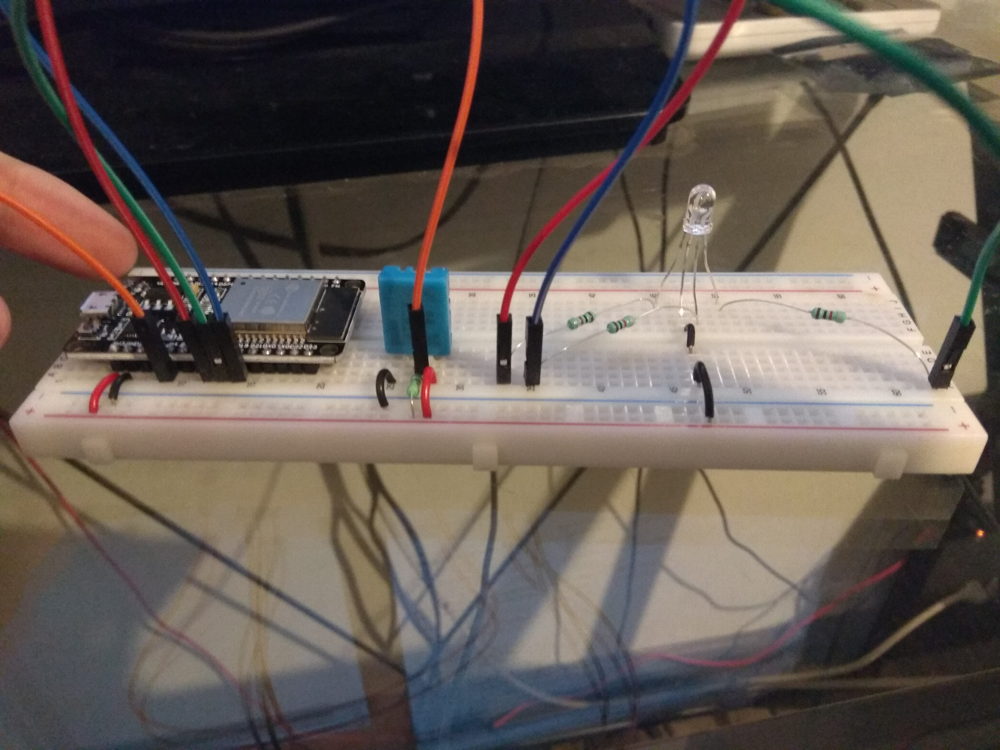
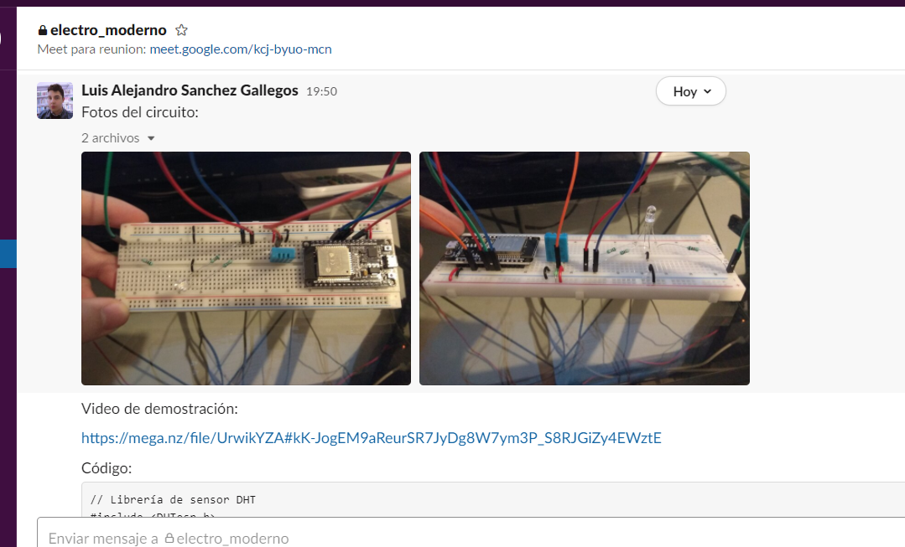
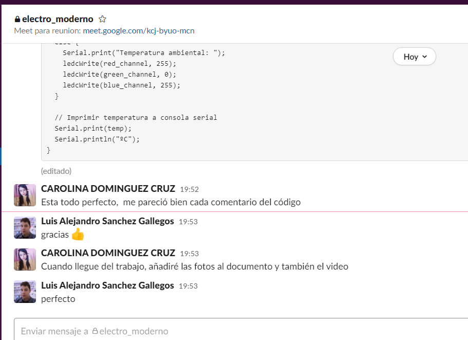

# :trophy: A.3.3 Actividad de aprendizaje

Circuito de medición de temperatura a través de un NodeMCU ESP32
___

## Instrucciones

- Basado en la figura 1, ensamblar un sistema, capaz de detectar la temperatura y humedad del ambiente, a través de un circuito electrónico, utilizando un NodeMCU **ESP32**, y un **Sensor DHT11/DHT22**.
- Toda actividad o reto se deberá realizar utilizando el estilo **MarkDown con extension .md** y el entorno de desarrollo VSCode, debiendo ser elaborado como un documento **single page**, es decir si el documento cuanta con imágenes, enlaces o cualquier documento externo debe ser accedido desde etiquetas y enlaces, y debe ser nombrado con la nomenclatura **A3.3_NombreApellido_Equipo.pdf.**
- Es requisito que el .md contenga una etiqueta del enlace al repositorio de su documento en GITHUB, por ejemplo **Enlace a mi GitHub** y al concluir el reto se deberá subir a github.
- Desde el archivo **.md** exporte un archivo **.pdf** que deberá subirse a classroom dentro de su apartado correspondiente, sirviendo como evidencia de su entrega, ya que siendo la plataforma **oficial** aquí se recibirá la calificación de su actividad.
- Considerando que el archivo .PDF, el cual fue obtenido desde archivo .MD, ambos deben ser idénticos.
- Su repositorio ademas de que debe contar con un archivo **readme**.md dentro de su directorio raíz, con la información como datos del estudiante, equipo de trabajo, materia, carrera, datos del asesor, e incluso logotipo o imágenes, debe tener un apartado de contenidos o indice, los cuales realmente son ligas o **enlaces a sus documentos .md**, _evite utilizar texto_ para indicar enlaces internos o externo.
- Se propone una estructura tal como esta indicada abajo, sin embargo puede utilizarse cualquier otra que le apoye para organizar su repositorio.
  
```
- readme.md
  - blog
    - C3.1_TituloActividad.md
    - C3.2_TituloActividad.md
    - C3.3_TituloActividad.md
    - C3.4_TituloActividad.md
    - C3.5_TituloActividad.md
    - C3.6_TituloActividad.md
    - C3.7_TituloActividad.md
    - C3.8_TituloActividad.md
  - img
  - docs
    - A3.1_TituloActividad.md
    - A3.2_TituloActividad.md
    - A3.3_TituloActividad.md
```

### Fuentes de apoyo para desarrollar la actividad:

   - [x] [Random Nerd Tutorial Touch pin](https://randomnerdtutorials.com/esp32-touch-pins-arduino-ide/)

   - [x] [Ejemplo de circuito con LED RGB Led](https://i0.wp.com/saber.patagoniatec.com/wp-content/uploads/2019/07/led-rgb-catodo-anado-comun.jpg)

___

## Desarrollo

1.Utilice el siguiente listado de materiales para la elaboración de la actividad

| Cantidad | Descripción | Fuente de consulta |
| -------- | ------------ |---------------- |
| 1        | Sensor temperatura y humedad DHT11 o DHT22 |  [Mercado Libre](https://articulo.mercadolibre.com.mx/MLM-664315278-sensor-de-temperatura-y-humedad-dht11-cjumpers-arduino-pic-_JM#position=1&type=item&tracking_id=b203e8cd-c375-429a-9b75-8c57e8b35386)|
| 1        | Diodo led RGB      | [Mercado Libre](https://articulo.mercadolibre.com.mx/MLM-659473859-10-led-rgb-5mm-anodo-catodo-comun-ultrabrillante-_JM#position=1&type=item&tracking_id=088ebd66-b6d7-4bff-acd5-d97bb0ae0141)|
| 1        | Resistencia 4.7 kohms |[geekbotelectronics](http://www.geekbotelectronics.com/producto/resistencia-4-7-kohm-1-w/)| 
| 3        | Resistencias 1 kohm |[Steren](https://www.steren.com.mx/resistencia-de-carbon-de-1-watt-al-5-de-tolerancia-de-1-kohm.html) |
| 1        | Fuente de voltaje de 5V | [Amazon](https://www.amazon.com.mx/MEAN-WELL-RS-15-5-Supply-Single/dp/B005T6UJBU/ref=sr_1_5?adgrpid=56956944159&dchild=1&gclid=EAIaIQobChMI2Y_62Oaj7QIVytXACh3YEgMjEAAYAiAAEgKMvvD_BwE&hvadid=286733406622&hvdev=c&hvlocphy=9073855&hvnetw=g&hvqmt=b&hvrand=6503878510499796171&hvtargid=kwd-297022971043&hydadcr=26975_9558215&keywords=fuente+5v+2a&qid=1606517196&sr=8-5&tag=googhydr0mx-20)|
| 1        | NodeMCU ESP32| [Mercado Libre](https://articulo.mercadolibre.com.mx/MLM-587686290-esp32-wifi-bluetooth-42-ble-nodemcu-esp8266-libro-gratis-_JM#position=1&type=item&tracking_id=84a6234b-5016-47eb-9950-39b49846ca72) |
| 1        | BreadBoard |[Amazon](https://www.amazon.com.mx/Deke-Home-Breadboard-distribuci%C3%B3n-electr%C3%B3nica/dp/B086C9HK7V/ref=sr_1_22?__mk_es_MX=%C3%85M%C3%85%C5%BD%C3%95%C3%91&dchild=1&keywords=breadboard&qid=1599003455&sr=8-22) |
| 1        | Jumpers M/M | [Amazon](https://www.amazon.com.mx/ELEGOO-Macho-Hembra-Macho-Macho-Hembra-Hembra-Protoboard/dp/B06ZXSQ5WG/ref=sr_1_1?__mk_es_MX=%C3%85M%C3%85%C5%BD%C3%95%C3%91&dchild=1&keywords=jumper+wires&qid=1599003519&sr=8-1)|
       

2. Basado en las imágenes que se muestran en la **Figuras 1**, ensamble el circuito en un solo circuito electrónico, ide tal manera que se pueda obtener un sistema capaz de cumplir con las instrucciones antes solicitadas para esta actividad.
  


3.  Una vez ensamblado el circuito anterior, agregue un LED RGB y elabore el programa que le permita al LED RGB funcionar como indicador para las siguientes condiciones:
    - El sensor de temperatura en todo momento estará sensando, enviando el valor registrado por la terminal serial, por ejemplo "Temperatura ambiente: 25 grados" y el **LED RGB** estará encendido de color verde.
    - El sensor de temperatura al registrar un valor del -20% por arriba de la temperatura ambiental, deberá mostrar el mensaje "Temperatura alta: ? grados" y el **LED RGB** se encenderá de color rojo.
    - El sensor de temperatura al registra un valor del -20% por abajo de la temperatura ambiental, deberá mostrar el mensaje "Temperatura baja: ? grados" y el **LED RGB** se encenderá de color azul.
4. Coloque aquí evidencias que considere importantes durante el desarrollo de la actividad.

# **Video de demostracion:**
 [Explicacion](https://mega.nz/file/UrwikYZA#kK-JogEM9aReurSR7JyDg8W7ym3P_S8RJGiZy4EWztE)

# **Practica:**


### **Temperatura alta:  26 grados**

### **Temperatura Ambiental:  25 grados**

### **Temperatura Baja:  22 grados**


# **Codigo**

```c
 // Librería de sensor DHT
#include <DHTesp.h>
​
// Pin para el sensor de temperatura
const int temp_sensor_pin = 4;
​
// Objeto para la librería de sensor
DHTesp dht;
​
// Pin y canal para color rojo
const int red_pin = 5;
const int red_channel = 0;
​
// Pin y canal para color verde
const int green_pin = 18;
const int green_channel = 1;
​
// Pin y canal para color azul
const int blue_pin = 19;
const int blue_channel = 2;
​
// Frecuencia y resolución para los LEDs
const int frequency = 5000;
const int resolution = 8;
​
// Temperatura baja, alta, y de lectura
const float low_temp = 22;
const float high_temp = 26;
float temp;
​
void setup() {
  // Iniciar consola serial
  Serial.begin(115200);
  
  // Configurar canales LED
  ledcSetup(red_channel, frequency, resolution);
  ledcAttachPin(red_pin, red_channel);
​
  ledcSetup(green_channel, frequency, resolution);
  ledcAttachPin(green_pin, green_channel);
​
  ledcSetup(blue_channel, frequency, resolution);
  ledcAttachPin(blue_pin, blue_channel);
​
  // Configurar sensor
  dht.setup(temp_sensor_pin, DHTesp::DHT11);
}
​
void loop() {
  // Obtener temperatura
  temp = dht.getTemperature();
​
  // Apagar LED
  // Se ponen todos los canales en su valor máximo porque es un LED de ánodo común
  ledcWrite(red_channel, 255);
  ledcWrite(green_channel, 255);
  ledcWrite(blue_channel, 255);
​
  // Si la temperatura es mayor al límite superior, encender LED rojo
  if (temp >= high_temp) {
    Serial.print("Temperatura alta: ");
    ledcWrite(red_channel, 0);
    ledcWrite(green_channel, 255);
    ledcWrite(blue_channel, 255);
  }
  // Si la temperatura es menor al límite inferior, encender LED azul
  else if (temp <= low_temp) {
    Serial.print("Temperatura baja: ");
    ledcWrite(red_channel, 255);
    ledcWrite(green_channel, 255);
    ledcWrite(blue_channel, 0);
  }
  // Si la temperatura no sobrepasa ningún límite, encender LED verde
  else {
    Serial.print("Temperatura ambiental: ");
    ledcWrite(red_channel, 255);
    ledcWrite(green_channel, 0);
    ledcWrite(blue_channel, 255);
  }
​
  // Imprimir temperatura a consola serial
  Serial.print(temp);
  Serial.println("ºC");
}
```

## **Reunion:**



5. Conclusiones Individuales
  
- **Carolina Dominguez Cruz:**
Este circuito esta conformado con un sensor de temperatura y al momento de mostrarlo en el codigo, se imprime el mensaje de la temperatura en grados celcius. La temperatura ambiental de la habitacion de mi compañero Luis mostro inicialmente una temperatura de 26 grados y asi seguira hasta que baje o suba la temperatura, pero a uno momento bajo hasta 25 grados el LED RGB se mostro de color verde y despues en los 22 grados a color azul, por ser la temperatura minima. En el codigo se muestra "else if" para saber hasta que grado tiene que cambiar el color el LED y el mensaje que tiene que imprimir.

- **Cesar Isaac Soto García:**
En esta actividad se aprendio a controlar el sensor de temperatura y a como utilizar la libreria DHT  que sirve para manipular los dato de los sensores tipo DHT que manejan los sensores, tambien se aprendio a manejar el ESP32 ya que el equipo no contaba con el antes, y debido a eso no sabiamos como se utilizaba el PWM y los valores de frecuencia y resolucion.
  
- **Luis Alejandro Sanchez Gallegos:** 
Además de aprender a como crear un dispositivo de alerta de temperatura básico, el aprendizaje más interesante de esta práctica fue la facilidad y comodidad que el uso de las librerías nos brinda como programadores. Utilicé este mismo sensor en una clase de un semestre anterior. En ese entonces fue necesario encontrar, leer, e interpretar los manuales del sensor para poder utilizarlo, lo cual se hizo multiplicando el valor del voltaje devuelto por el sensor por un factor específico que resulta en la temperatura detectada por este. Por el contrario, al integrar la librería (descargada y manejada con facilidad a través del IDE de Arduino) lo único que se debió hacer es crear una instancia de la clase dada por la librería y llamar una de sus funciones, lo cual instantáneamente devuelve un valor de temperatura en la escala requerida. Las librerías son verdaderamente una de las herramientas más útiles para los programadores.

___

### :bomb: Rubrica

| Criterios     | Descripción        | Puntaje |
| ------------- | ------------------- | ------- |
| Instrucciones | Se cumple con cada uno de los puntos indicados dentro del apartado Instrucciones?            | 10      |
| Desarrollo    | Se respondió a cada uno de los puntos solicitados dentro del desarrollo de la actividad?     | 60      |
| Demostración  | El alumno se presenta durante la explicación de la funcionalidad de la actividad?            | 20      |
| Conclusiones  | Se incluye una opinión personal de la actividad  por cada uno de los integrantes del equipo? | 10      |

[:arrow_left: Volver al Índice](../README.md)
​

[:bookmark_tabs: Repositorio en GitHub de Carolina Dominguez Cruz](https://github.com/CarolinaDominguez18/SistemasProgramables)
​

[:bookmark_tabs: Repositorio en GitHub de Cesar Soto García](https://github.com/cesarsoto2/CesarSotoRepost)
​

[:bookmark_tabs: Repositorio en GitHub Luis Alejandro Sanchez Gallegos](https://github.com/alex-gallegos-tec/sistemas-programables)