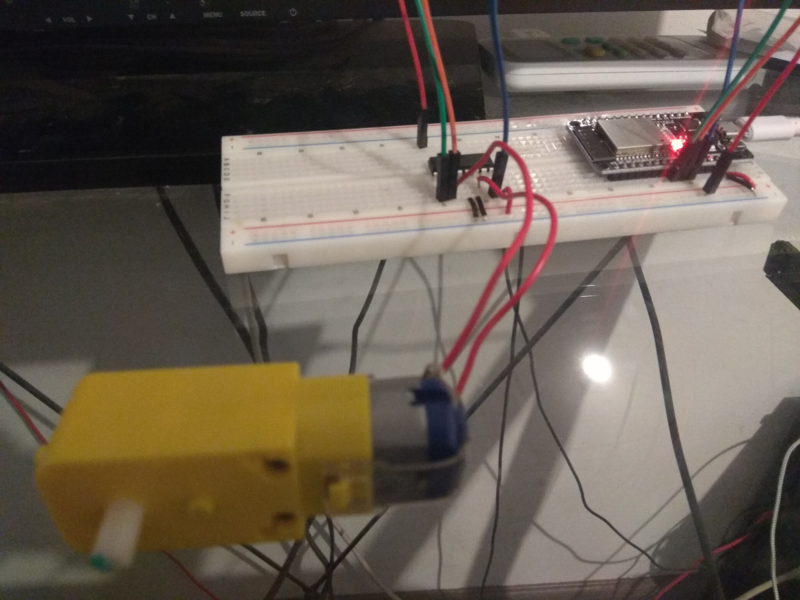
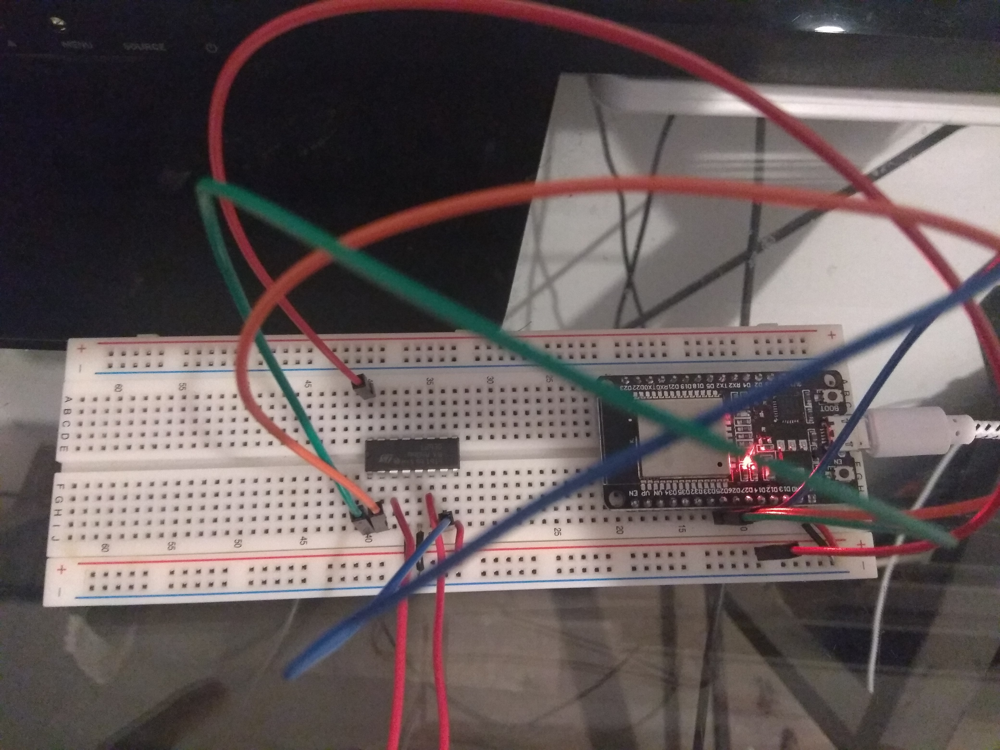
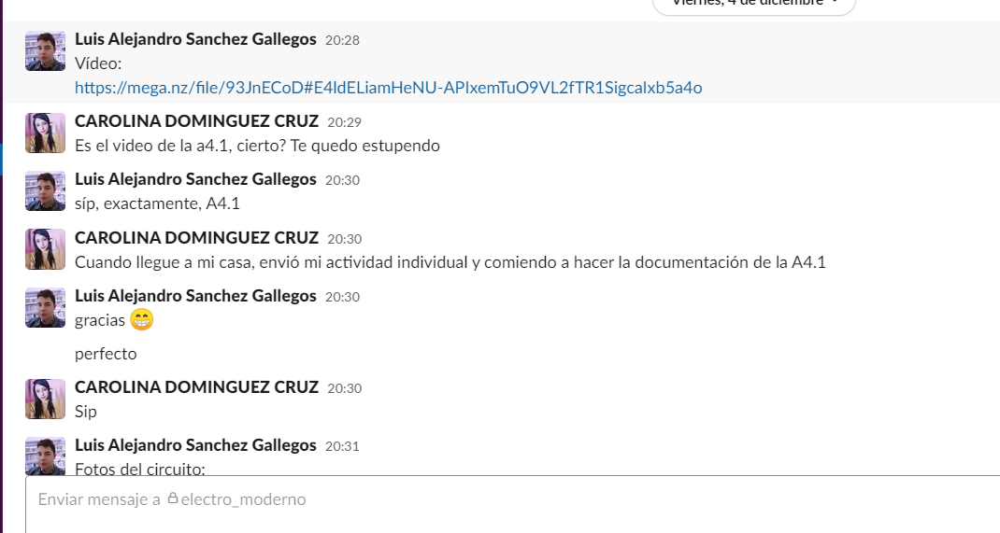
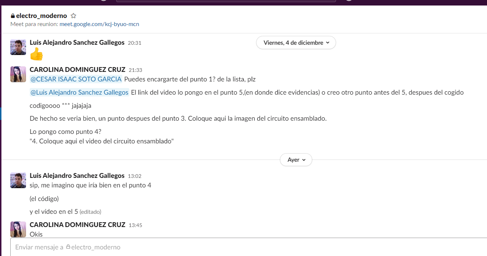
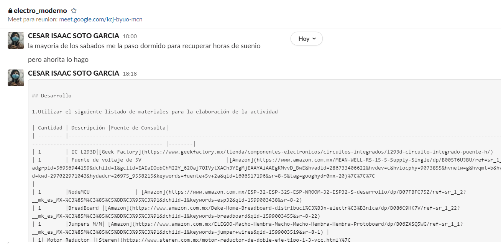

# :trophy: A4.1 Actividad de aprendizaje

Circuito de control para activar y desactivar un motor DC, utilizando  NodeMCU ESP32 por medio de Bluetooth
___

## Instrucciones

- Realizar un sistema ensamblado de control por medio de **Bluetooth**, capaz de control a un motor DC, utilizando un NodeMCU **ESP32**, un y un **IC L293D**.
- Toda actividad o reto se deberá realizar utilizando el estilo **MarkDown con extension .md** y el entorno de desarrollo VSCode, debiendo ser elaborado como un documento **single page**, es decir si el documento cuanta con imágenes, enlaces o cualquier documento externo debe ser accedido desde etiquetas y enlaces, y debe ser nombrado con la nomenclatura **A4.1_NombreApellido_Equipo.pdf.**
- Es requisito que el .md contenga una etiqueta del enlace al repositorio de su documento en GITHUB, por ejemplo **Enlace a mi GitHub** y al concluir el reto se deberá subir a github.
- Desde el archivo **.md** exporte un archivo **.pdf** que deberá subirse a classroom dentro de su apartado correspondiente, sirviendo como evidencia de su entrega, ya que siendo la plataforma **oficial** aquí se recibirá la calificación de su actividad.
- Considerando que el archivo .PDF, el cual fue obtenido desde archivo .MD, ambos deben ser idénticos.
- Su repositorio ademas de que debe contar con un archivo **readme**.md dentro de su directorio raíz, con la información como datos del estudiante, equipo de trabajo, materia, carrera, datos del asesor, e incluso logotipo o imágenes, debe tener un apartado de contenidos o indice, los cuales realmente son ligas o **enlaces a sus documentos .md**, _evite utilizar texto_ para indicar enlaces internos o externo.
- Se propone una estructura tal como esta indicada abajo, sin embargo puede utilizarse cualquier otra que le apoye para organizar su repositorio.
  
```
- readme.md
  - blog
    - C4.1_TituloActividad.md
    - C4.2_TituloActividad.md
    - C4.3_TituloActividad.md
    - C4.4_TituloActividad.md    
  - img
  - docs
    - A4.1_TituloActividad.md
    - A4.2_TituloActividad.md
    - A4.3_TituloActividad.md
```
___

### Fuentes de apoyo para desarrollar la actividad

- [x] [Random Nerd Tutorial DHT Humedad y temperatura](https://randomnerdtutorials.com/esp32-dht11-dht22-temperature-humidity-sensor-arduino-ide/)
- [x] [Motor DC con IC L293 y ESP32](https://www.hackster.io/Oniichan_is_ded/l293d-with-esp32-wemos-lolin-d32-v2-hacked-edition-ea2086)

___

## Desarrollo

1.Utilizar el siguiente listado de materiales para la elaboración de la actividad
| Cantidad | Descripción |Fuente de Consulta|                                                                                                                                                                                                               
| -------- |---------------------- |--------|
| 1        | IC L293D|[Geek Factory](https://www.geekfactory.mx/tienda/componentes-electronicos/circuitos-integrados/l293d-circuito-integrado-puente-h/)
| 1        | Fuente de voltaje de 5V |[Amazon](https://www.amazon.com.mx/MEAN-WELL-RS-15-5-Supply-Single/dp/B005T6UJBU/ref=sr_1_5?adgrpid=56956944159&dchild=1&gclid=EAIaIQobChMI2Y_62Oaj7QIVytXACh3YEgMjEAAYAiAAEgKMvvD_BwE&hvadid=286733406622&hvdev=c&hvlocphy=9073855&hvnetw=g&hvqmt=b&hvrand=6503878510499796171&hvtargid=kwd-297022971043&hydadcr=26975_9558215&keywords=fuente+5v+2a&qid=1606517196&sr=8-5&tag=googhydr0mx-20) |
| 1        |NodeMCU  | [Amazon](https://www.amazon.com.mx/ESP-32-ESP-32S-ESP-WROOM-32-ESP32-S-desarrollo/dp/B07TBFC75Z/ref=sr_1_2?__mk_es_MX=%C3%85M%C3%85%C5%BD%C3%95%C3%91&dchild=1&keywords=esp32&qid=1599003438&sr=8-2) 
| 1        |BreadBoard |[Amazon](https://www.amazon.com.mx/Deke-Home-Breadboard-distribuci%C3%B3n-electr%C3%B3nica/dp/B086C9HK7V/ref=sr_1_22?__mk_es_MX=%C3%85M%C3%85%C5%BD%C3%95%C3%91&dchild=1&keywords=breadboard&qid=1599003455&sr=8-22)   
| 1        |Jumpers M/M| [Amazon](https://www.amazon.com.mx/ELEGOO-Macho-Hembra-Macho-Macho-Hembra-Hembra-Protoboard/dp/B06ZXSQ5WG/ref=sr_1_1?__mk_es_MX=%C3%85M%C3%85%C5%BD%C3%95%C3%91&dchild=1&keywords=jumper+wires&qid=1599003519&sr=8-1) |
| 1| Motor Reductor |[Steren](https://www.steren.com.mx/motor-reductor-de-doble-eje-tipo-i-3-vcc.html)


2. Basado en las imágenes que se muestran en las **Figura 1**, ensamblar un circuito electrónico, con la finalidad de obtener un sistema capaz de cumplir con las instrucciones siguientes:
   
  + Por medio de la aplicación "Serial Bluetooth terminal" que puede ser descargada del play Store de google o incluso cualquier otra que considere, se deberá controlar el arranque y apagado de un motor DC, es decir se contara con dos peticiones, la cual una de ellas representara el "START" y la otra opción "STOP"
  + El motor debe ser capaz de girar a favor de las manecillas del reloj durante 5 segundos, al cumplirse ese tiempo debe frenar 1 segundo e invertirá su giro durante otros 5 segundos.  
    


3. Coloque aqui la imagen del circuito ensamblado
  


 
  
4. Coloque en este lugar el programa creado dentro del entorno de Arduino

```c
#include "BluetoothSerial.h"
const int ENABLE_PIN = 25;    // Pin para habilitar el puente H
const int CONTROL_PIN_A = 26; // Pin de control (sentido del reloj)
const int CONTROL_PIN_B = 27; // Pin de control (sentido contrario)
int motor_start_time = 0; // Momento en el que se activa el motor
bool motor_on = false;    // Bandera para la secuencia del motor
int bt_value = ' ';      // Valor de lectura de la consola bluetooth
BluetoothSerial SerialBT; // Objeto para la consola bluetooth
void setup() {
  Serial.begin(115200);    // Iniciar consola serial
  SerialBT.begin("ESP32"); // Iniciar consola bluetooth
  pinMode(ENABLE_PIN, OUTPUT);
  pinMode(CONTROL_PIN_A, OUTPUT);
  pinMode(CONTROL_PIN_B, OUTPUT);
}
void loop() {
  if (SerialBT.available()) {   // Si hay algún mensaje bluetooth disponible...
    bt_value = SerialBT.read(); // ...lee el valor del mensaje
    Serial.write(bt_value);
    if (bt_value == '1') start_sequence();
    else if (bt_value == '0') stop_sequence();
  }
  if (motor_on) check_motor_status();
}
// Iniciar la secuencia del motor
void start_sequence() {
  motor_start_time = millis();
  motor_on = true;
}
// Detener la secuencia del motor
void stop_sequence() {
  stop_motor();
  motor_on = false;
}
// Control de la secuencia del motor
void check_motor_status() {
  int elapsed_time = millis() - motor_start_time;           // Tiempo transcurrido desde la activación del motor
  if (elapsed_time < 5000) motor_clockwise();               // Sentido del reloj
  else if (elapsed_time < 6000) stop_motor();               // Detener motor
  else if (elapsed_time < 11000) motor_counter_clockwise(); // Sentido opuesto
  else if (elapsed_time < 12000) stop_motor();              // Detener motor
  else start_sequence();                                    // Reiniciar secuencia
}
// Detener motor
void stop_motor() {
  digitalWrite(ENABLE_PIN, LOW);
  digitalWrite(CONTROL_PIN_A, LOW);
  digitalWrite(CONTROL_PIN_B, LOW);
}
// Activar motor en sentido del reloj
void motor_clockwise() {
  digitalWrite(ENABLE_PIN, HIGH);
  digitalWrite(CONTROL_PIN_A, HIGH);
  digitalWrite(CONTROL_PIN_B, LOW);
}
// Activar motor en sentido opuesto
void motor_counter_clockwise() {
  digitalWrite(ENABLE_PIN, HIGH);
  digitalWrite(CONTROL_PIN_A, LOW);
  digitalWrite(CONTROL_PIN_B, HIGH);
}
```
5. Coloque aqui el video del circuito ensamblado

#### **Video de demostracion:**
 [Explicacion](https://mega.nz/file/93JnECoD#E4ldELiamHeNU-APIxemTuO9VL2fTR1SigcaIxb5a4o)
   
6. Coloque aquí evidencias que considere importantes durante el desarrollo de la actividad.







   
7. Conclusiones individuales
- **Carolina Dominguez Cruz:**
En esta plactica utilizamos una app llamada Serial Bluetooth terminal, para poder controlar el motor que esta conectado al circuito junto con el ESP 32. El motor al momento de darle click en el boton "Star" de la aplicacion, comenzara a girar al lado derecho(del mismo manecillas del reloj) durante unos cuantos segundos. Y al darle click en el boton "Stop" el motor dejara de girar.
En el codigo, para el tiempo transcurrido desde se inicio del motor se codificaron varios "Else if" que mostrara el lapso de tiempo de rotacion que seria 5000 (5 segundos), tambien el lapso para detener dicho motor y reiniciar la misma secuencia.

- **Cesar Isaac Soto García:**
En conclusión esta actividad me pareció interesante  ya que en lo personal estoy trabajando en un proyecto que implica manejar bluetooth y el Arduino aun que en este caso se utilizo ESP32 creo ya darme una idea de como mandar datos, en relacion a la actividad aprendí mucho sobre como programar bloques en Arduino y mandar datos por bluetooth y manejar los motores es algo interesante.
  
- **Luis Alejandro Sanchez Gallegos:** 
En una actividad anterior mencioné que el campo de la electrónica parece ser una labor cooperativa entre empresas que crean componentes que facilitan el uso e integración de otros. Creo que esta actividad es otro ejemplo más de lo mismo. El dispositivo IC L293D (o puente-H) está diseñado para facilitar el control de motores de corriente directa, cosa que, de no existir este componente, tendríamos que haber organizado por nuestra cuenta, lo cual implica investigar la manera de controlar un motor DC y construir la estructura necesaria con los componentes indicados. Pero gracias a la existencia del puente-H es tan sencillo como leer la especificación del circuito y conectar nuestras terminales de forma indicada.
___

### :bomb: Rubrica

| Criterios     | Descripción                                                                                  | Puntaje |
| ------------- | -------------------------------------------------------------------------------------------- | ------- |
| Instrucciones | Se cumple con cada uno de los puntos indicados dentro del apartado Instrucciones?            | 10      |
| Desarrollo    | Se respondió a cada uno de los puntos solicitados dentro del desarrollo de la actividad?     | 60      |
| Demostración  | El alumno se presenta durante la explicación de la funcionalidad de la actividad?            | 20      |
| Conclusiones  | Se incluye una opinión personal de la actividad  por cada uno de los integrantes del equipo? | 10      |


[:arrow_left: Volver al Índice](../README.md)
​

[:bookmark_tabs: Repositorio en GitHub de Carolina Dominguez Cruz](https://github.com/CarolinaDominguez18/SistemasProgramables)
​

[:bookmark_tabs: Repositorio en GitHub de Cesar Soto García](https://github.com/cesarsoto2/CesarSotoRepost)
​

[:bookmark_tabs: Repositorio en GitHub Luis Alejandro Sanchez Gallegos](https://github.com/alex-gallegos-tec/sistemas-programables)