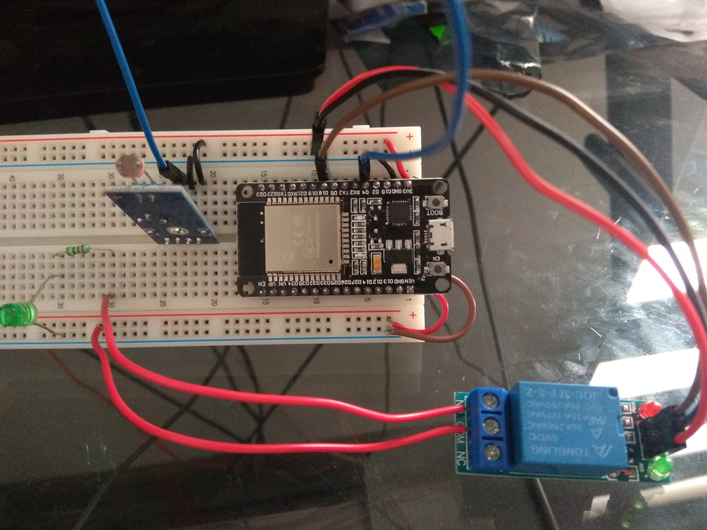
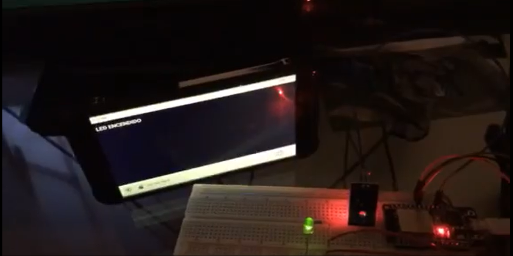
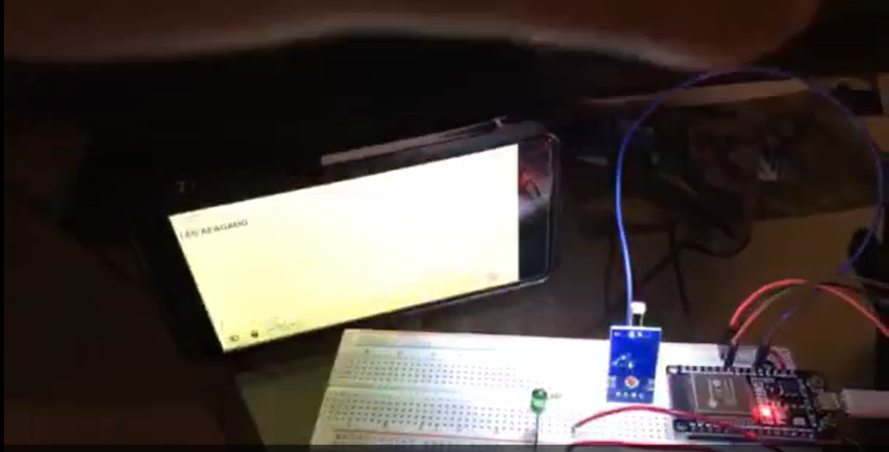
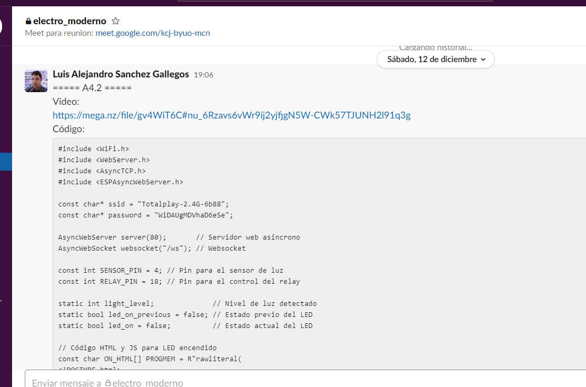
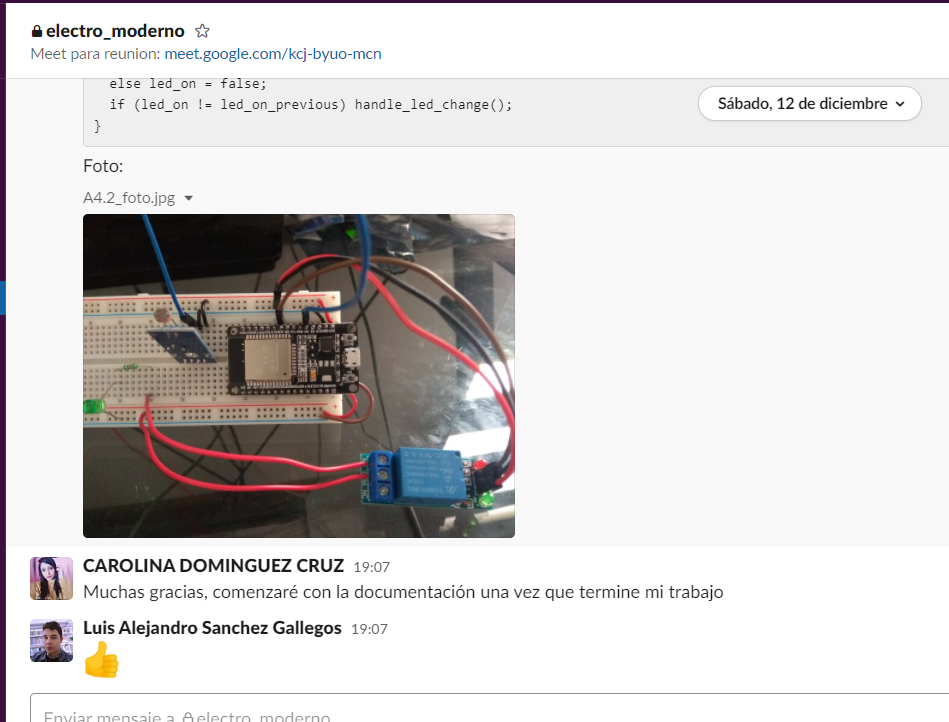
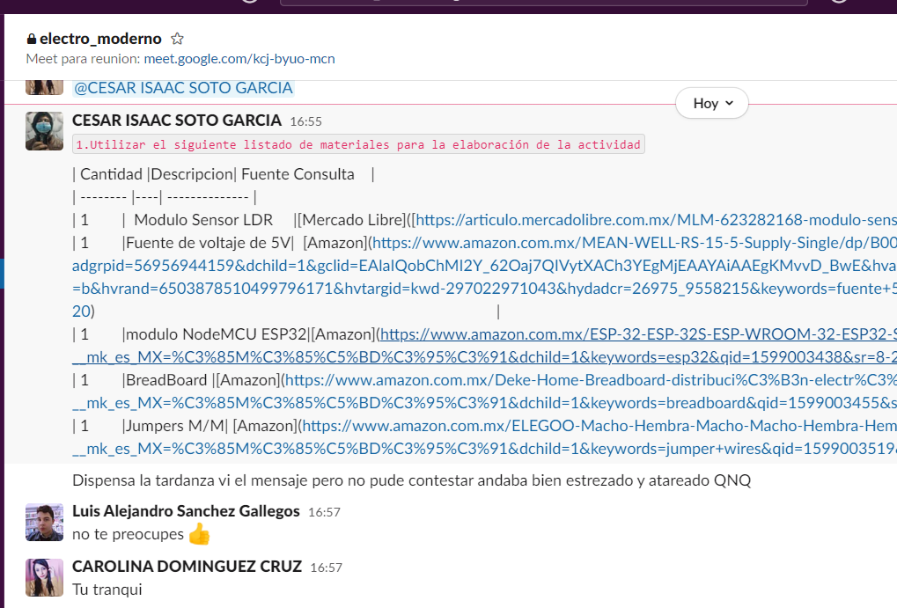

# :trophy: A4.2 Actividad de aprendizaje

Circuito sensor de iluminación y actuación de luz NodeMCU ESP32 por medio de Wi-Fi
___

## Instrucciones

- Realizar un sistema de medición y actuación de luz ambiental, utilizando el protocolo de comunicación **Wi-FI**, asi como un NodeMCU **ESP32**, un sensor  **LDR**, un diodo LED.
- Toda actividad o reto se deberá realizar utilizando el estilo **MarkDown con extension .md** y el entorno de desarrollo VSCode, debiendo ser elaborado como un documento **single page**, es decir si el documento cuanta con imágenes, enlaces o cualquier documento externo debe ser accedido desde etiquetas y enlaces, y debe ser nombrado con la nomenclatura **A4.2_NombreApellido_Equipo.pdf.**
- Es requisito que el .md contenga una etiqueta del enlace al repositorio de su documento en GITHUB, por ejemplo **Enlace a mi GitHub** y al concluir el reto se deberá subir a github.
- Desde el archivo **.md** exporte un archivo **.pdf** que deberá subirse a classroom dentro de su apartado correspondiente, sirviendo como evidencia de su entrega, ya que siendo la plataforma **oficial** aquí se recibirá la calificación de su actividad.
- Considerando que el archivo .PDF, el cual fue obtenido desde archivo .MD, ambos deben ser idénticos.
- Su repositorio ademas de que debe contar con un archivo **readme**.md dentro de su directorio raíz, con la información como datos del estudiante, equipo de trabajo, materia, carrera, datos del asesor, e incluso logotipo o imágenes, debe tener un apartado de contenidos o indice, los cuales realmente son ligas o **enlaces a sus documentos .md**, _evite utilizar texto_ para indicar enlaces internos o externo.
- Se propone una estructura tal como esta indicada abajo, sin embargo puede utilizarse cualquier otra que le apoye para organizar su repositorio.
  
```
- readme.md
  - blog
    - C4.1_TituloActividad.md
    - C4.2_TituloActividad.md
    - C4.3_TituloActividad.md
    - C4.4_TituloActividad.md    
  - img
  - docs
    - A4.1_TituloActividad.md
    - A4.2_TituloActividad.md
    - A4.3_TituloActividad.md
```
___

### Fuentes de apoyo para desarrollar la actividad

   - [x] [ESP32 Web Server](https://randomnerdtutorials.com/esp32-web-server-arduino-ide/)
   - [x] [LDR con ESP32](https://www.youtube.com/watch?v=A3qcN2mzv0Q)
   
___

## Desarrollo

1.Utilizar el siguiente listado de materiales para la elaboración de la actividad

| Cantidad |Descripcion| Fuente Consulta    |
| -------- |----| -------------- |
| 1        |  Modulo Sensor LDR     |[Mercado Libre]([https://articulo.mercadolibre.com.mx/MLM-623282168-modulo-sensor-de-luz-ldr-_JM)        |
| 1        |Fuente de voltaje de 5V|  [Amazon](https://www.amazon.com.mx/MEAN-WELL-RS-15-5-Supply-Single/dp/B005T6UJBU/ref=sr_1_5?adgrpid=56956944159&dchild=1&gclid=EAIaIQobChMI2Y_62Oaj7QIVytXACh3YEgMjEAAYAiAAEgKMvvD_BwE&hvadid=286733406622&hvdev=c&hvlocphy=9073855&hvnetw=g&hvqmt=b&hvrand=6503878510499796171&hvtargid=kwd-297022971043&hydadcr=26975_9558215&keywords=fuente+5v+2a&qid=1606517196&sr=8-5&tag=googhydr0mx-20)           |
| 1        |modulo NodeMCU ESP32|[Amazon](https://www.amazon.com.mx/ESP-32-ESP-32S-ESP-WROOM-32-ESP32-S-desarrollo/dp/B07TBFC75Z/ref=sr_1_2?__mk_es_MX=%C3%85M%C3%85%C5%BD%C3%95%C3%91&dchild=1&keywords=esp32&qid=1599003438&sr=8-2)                |
| 1        |BreadBoard |[Amazon](https://www.amazon.com.mx/Deke-Home-Breadboard-distribuci%C3%B3n-electr%C3%B3nica/dp/B086C9HK7V/ref=sr_1_22?__mk_es_MX=%C3%85M%C3%85%C5%BD%C3%95%C3%91&dchild=1&keywords=breadboard&qid=1599003455&sr=8-22)   
| 1        |Jumpers M/M| [Amazon](https://www.amazon.com.mx/ELEGOO-Macho-Hembra-Macho-Macho-Hembra-Hembra-Protoboard/dp/B06ZXSQ5WG/ref=sr_1_1?__mk_es_MX=%C3%85M%C3%85%C5%BD%C3%95%C3%91&dchild=1&keywords=jumper+wires&qid=1599003519&sr=8-1) | (editado) 

2. Basado en la imágen que se muestran en las **Figura 1**, ensamble un circuito electrónico y agregue un Led a una de las terminales del dispositivo, de tal manera que se pueda obtener un sistema capaz de cumplir con las instrucciones siguiente:
    - Se deberá utilizar el NodeMCU como un **standalone Web server**, el cual debera proveer una interface visual, que mostrara una imagen representando un comportamiento de "ON y OFF" dependiendo de la condición de iluminación ambiental.
    - El sensor de iluminación deberá estar midiendo la cantidad de luz que existen en el ambiente.
    - Al momento de detectar el sensor LDR, ausencia de luz deberá mostrar en la interface Web un estado "ON", y en caso contrario deberá representarse el estado "OFF".
    - Al circuito de la figura 1 se le deberá agregar un relevador en serie con una bombilla, que sera activada en condición opuesta al estado "ON" y "OFF", es decir una vez que el sensor detecto poca o nula iluminación activara el rele y por ente encenderá la bombilla, y en caso contrario lo apagara.

[Fuente de apoyo Random Nerd Tutorial](https://randomnerdtutorials.com/esp32-web-server-arduino-ide/)
    


3. Coloque aquí la imagen del circuito ensamblado







4. Coloque en este lugar el programa creado dentro del entorno de Arduino


```C
#include <WiFi.h>
#include <WebServer.h>
#include <AsyncTCP.h>
#include <ESPAsyncWebServer.h>
const char* ssid = "Totalplay-2.4G-6b88";
const char* password = "WiDAUgMDVhaD6eSe";
AsyncWebServer server(80);       // Servidor web asíncrono
AsyncWebSocket websocket("/ws"); // Websocket
const int SENSOR_PIN = 4; // Pin para el sensor de luz
const int RELAY_PIN = 18; // Pin para el control del relay
static int light_level;              // Nivel de luz detectado
static bool led_on_previous = false; // Estado previo del LED
static bool led_on = false;          // Estado actual del LED
// Código HTML y JS para LED encendido
const char ON_HTML[] PROGMEM = R"rawliteral(
<!DOCTYPE html>
<html>
  <body style="background-color:black;color:white;">
    <h1>LED ENCENDIDO</h1>
    <script>
      const websocket = new WebSocket("ws://" + window.location.host + "/ws");
      websocket.addEventListener("open", _ => {console.log("WEBSOCKET CONECTADO");});
      websocket.addEventListener("message", _ => {location.reload();});
    </script>
  </body>
</html>
)rawliteral";
// Código HTML y JS para LED apagado
const char OFF_HTML[] PROGMEM = R"rawliteral(
<!DOCTYPE html>
<html>
  <body>
    <h1>LED APAGADO</h1>
    <script>
      const websocket = new WebSocket("ws://" + window.location.host + "/ws");
      websocket.addEventListener("open", _ => {console.log("WEBSOCKET CONECTADO");});
      websocket.addEventListener("message", _ => {location.reload();});
    </script>
  </body>
</html>
)rawliteral";
// Función para cambiar el estado del LED
void handle_led_change() {
  if (led_on) digitalWrite(RELAY_PIN, LOW);
  else digitalWrite(RELAY_PIN, HIGH);
  led_on_previous = led_on;
  websocket.textAll("CHANGE"); // Al cambiar el estado del LED se manda cualquier mesaje y el websocket simplemente recarga la página
}
/* El servidor web tiene que utilizar un pre-procesador...
 * ...pero nosotros no lo necesitamos, así que simplemente no hace nada. */
String processor(const String& var) {}
void setup() {
  pinMode(SENSOR_PIN, INPUT); // Activar pin para sensor
  pinMode(RELAY_PIN, OUTPUT); // Activar pin para relay
  Serial.begin(115200); // Iniciar consola serial
  WiFi.begin(ssid, password); // Conectar a wi-fi
  while (WiFi.status() != WL_CONNECTED) {
    delay(1000);
    Serial.print(".");
  }
  Serial.println("");
  Serial.println("Conectado a la red.");
  Serial.print("Dirección IP: ");
  Serial.println(WiFi.localIP());
  server.on("/", HTTP_GET, [](AsyncWebServerRequest *req){
    req->send_P(200, "text/html", led_on ? ON_HTML : OFF_HTML, processor);
  });
  server.addHandler(&websocket);
  server.begin();
  Serial.println("Servidor HTTP activo.");
  delay(1000);
}
void loop() {
  websocket.cleanupClients();
  light_level = digitalRead(SENSOR_PIN);
  if (light_level == HIGH) led_on = true;
  else led_on = false;
  if (led_on != led_on_previous) handle_led_change();
}
```
5. Coloque aqui el video del circuito ensamblado
   #### **Video de demostracion:**
   [Explicacion](https://mega.nz/file/gv4WiT6C#nu_6Rzavs6vWr9ij2yjfjgN5W-CWk57TJUNH2l91q3g)
   

6. Coloque aquí evidencias que considere importantes durante el desarrollo de la actividad.








7. Conclusiones individuales

- **Carolina Dominguez Cruz:**
En esta practica se utilizo un sensor, que al momento de proyectarse algo de luz, el sensor detecta esa luz y apaga el Led. Al momento de estar a oscuras, se enciende el LED. Al cambiar el estado del LED se manda cualquier mensaje y el websocket simplemente recarga la página. Al hacer ese proceso, cuando en el circuito estara conectado al WIFI para que en un dispositivo, muestre si el led esta encendido o apagado. 

- **Cesar Isaac Soto García:**
Me pareció realmente interesante el como se utiliza la conexión a wifi pues en lo personal no sabia que existía, y el aprender a utilizarlo independientemente de las limitaciones que este pueda llegar a presentar, es algo que hace sentir que despierta el interés para querer manejar en otro tipo de proyectos, por lo que entendí es algo difícil de manejar dependiendo el enfoque se que le de, ya que aumenta su dificultad y el observar que la falta de conocimientos por dispositivos electrónicos como conocimiento general nos hace mas difícil el realizar ciertas tareas. En lo personal Fue interesante y me dejo un gran interés por querer seguir utilizando estos dispositivos electrónicos.
  
- **Luis Alejandro Sanchez Gallegos:** 
Esta actividad presenta algo muy importante que hay que reconocer sobre los dispositivos electrónicos utilizados: no solo tienen capacidades sorprendentes para su escala, sino que también tienen ciertas limitantes que hay que considerar. Personalmente me parece impresionante que un dispositivo tan pequeño como la placa ESP32 sea no solo capaz de conectarse a una red a través de wi-fi sino también hospedar un servidor HTTP que sirve código HTML dentro de si mismo e incluso sea capaz de utilizar websockets. Sin embargo, el uso de este servidor HTTP es muy limitado ya que la placa no es capaz de realmente guardar archivos dentro de si misma (existen prácticas para superar esta limitante, pero sus capacidades también están limitadas) o de tener una base de datos. Así mismo, el uso de una conexión wi-fi dentro de la placa ESP32 requiere el uso de todos canales de su segundo lector analógico, dejando al programador con solamente seis entradas analógicas en caso de ser requeridas.
___

### :bomb: Rubrica

| Criterios     | Descripción          | Puntaje |
| ------------- | ------------------ | ------- |
| Instrucciones | Se cumple con cada uno de los puntos indicados dentro del apartado Instrucciones?            | 10      |
| Desarrollo    | Se respondió a cada uno de los puntos solicitados dentro del desarrollo de la actividad?     | 60      |
| Demostración  | El alumno se presenta durante la explicación de la funcionalidad de la actividad?            | 20      |
| Conclusiones  | Se incluye una opinión personal de la actividad  por cada uno de los integrantes del equipo? | 10      |


[:arrow_left: Volver al Índice](../README.md)
​

[:bookmark_tabs: Repositorio en GitHub de Carolina Dominguez Cruz](https://github.com/CarolinaDominguez18/SistemasProgramables)
​

[:bookmark_tabs: Repositorio en GitHub de Cesar Soto García](https://github.com/cesarsoto2/CesarSotoRepost)
​

[:bookmark_tabs: Repositorio en GitHub de Luis Alejandro Sanchez Gallegos](https://github.com/alex-gallegos-tec/sistemas-programables)