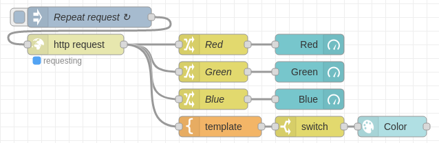

# :trophy: A5.1 Actividad de aprendizaje

Sistema sensor y actuacion del color de un objeto, e interface visual
___

## Instrucciones

- Realizar un sistema de identificacion de color utilizando un sensor de RGB TCS34725, un nodeMCU ESP32, un actuador Servomotor SG90, cualquier protocolo de comunicación y una interface visual que puede ser desarrollada por el equipo o apoyandose de otras como Node-red por ejemplo.
- Toda actividad o reto se deberá realizar utilizando el estilo **MarkDown con extension .md** y el entorno de desarrollo VSCode, debiendo ser elaborado como un documento **single page**, es decir si el documento cuanta con imágenes, enlaces o cualquier documento externo debe ser accedido desde etiquetas y enlaces, y debe ser nombrado con la nomenclatura **A5.1_NombreApellido_Equipo.pdf.**
- Es requisito que el .md contenga una etiqueta del enlace al repositorio de su documento en GITHUB, por ejemplo **Enlace a mi GitHub** y al concluir el reto se deberá subir a github.
- Desde el archivo **.md** exporte un archivo **.pdf** que deberá subirse a classroom dentro de su apartado correspondiente, sirviendo como evidencia de su entrega, ya que siendo la plataforma **oficial** aquí se recibirá la calificación de su actividad.
- Considerando que el archivo .PDF, el cual fue obtenido desde archivo .MD, ambos deben ser idénticos.
- Su repositorio ademas de que debe contar con un archivo **readme**.md dentro de su directorio raíz, con la información como datos del estudiante, equipo de trabajo, materia, carrera, datos del asesor, e incluso logotipo o imágenes, debe tener un apartado de contenidos o indice, los cuales realmente son ligas o **enlaces a sus documentos .md**, _evite utilizar texto_ para indicar enlaces internos o externo.
- Se propone una estructura tal como esta indicada abajo, sin embargo puede utilizarse cualquier otra que le apoye para organizar su repositorio.
  
```
- readme.md
  - blog
    - C5.1_TituloActividad.md
    - C5.2_TituloActividad.md    
  - img
  - docs
    - A5.1_TituloActividad.md
    - A5.2_TituloActividad.md    
```

___

## Desarrollo

1. Utilizar el siguiente listado de materiales para la elaboración de la actividad

| Cantidad | Descripción    |Fuente Consulta|
| -------- | -------------- |------|
| 1        | Sensor RGB TCS34725 |[Uelectronics](https://uelectronics.com/producto/modulo-sensor-de-reconocimiento-de-color-rgb-tcs34725/)
| 1 | Servomotor SG90  |[GeekFactory](https://www.geekfactory.mx/tienda/motores-actuadores-servos-y-accesorios/sg90-micro-servo-motor/)
| 1        | Fuente de voltaje de 5V|[Amazon](https://www.amazon.com.mx/MEAN-WELL-RS-15-5-Supply-Single/dp/B005T6UJBU/ref=sr_1_5?adgrpid=56956944159&dchild=1&gclid=EAIaIQobChMI2Y_62Oaj7QIVytXACh3YEgMjEAAYAiAAEgKMvvD_BwE&hvadid=286733406622&hvdev=c&hvlocphy=9073855&hvnetw=g&hvqmt=b&hvrand=6503878510499796171&hvtargid=kwd-297022971043&hydadcr=26975_9558215&keywords=fuente+5v+2a&qid=1606517196&sr=8-5&tag=googhydr0mx-20)           |
| 1        |NodeMCU ESP32| [Amazon](https://www.amazon.com.mx/ESP-32-ESP-32S-ESP-WROOM-32-ESP32-S-desarrollo/dp/B07TBFC75Z/ref=sr_1_2?__mk_es_MX=%C3%85M%C3%85%C5%BD%C3%95%C3%91&dchild=1&keywords=esp32&qid=1599003438&sr=8-2)                |
| 1        |BreadBoard| [Amazon](https://www.amazon.com.mx/Deke-Home-Breadboard-distribuci%C3%B3n-electr%C3%B3nica/dp/B086C9HK7V/ref=sr_1_22?__mk_es_MX=%C3%85M%C3%85%C5%BD%C3%95%C3%91&dchild=1&keywords=breadboard&qid=1599003455&sr=8-22)   |
| 1        |Jumpers M/M| [Amazon](https://www.amazon.com.mx/ELEGOO-Macho-Hembra-Macho-Macho-Hembra-Hembra-Protoboard/dp/B06ZXSQ5WG/ref=sr_1_1?__mk_es_MX=%C3%85M%C3%85%C5%BD%C3%95%C3%91&dchild=1&keywords=jumper+wires&qid=1599003519&sr=8-1) |

2. Basado en las imágenes que se muestran en las **Figura 1**, realizar un sistema capaz de cumplir con las siguientes condiciones:
   
   - La primer fase de la actividad consistira en, al colocar un objeto frente al sensor RGB, este debera identificar que color tiene (es recomendable utiizar objetos de color Rojo, Verde, y Azul para mayor precision), el cual debera mostrar en un interface visual que color fue detectado.
   - La segunda fase, consistira en agregar un actuador que y un identificador de color apoyandose de una banda de colores como se muestra en la imagen 1; al conocer el color del objeto el actuador debera apuntar al color que se esta detectando.


3. Coloque aquí la imagen del circuito ensamblado

**Circuito**


| Color| Circuito    |
| -------- | -------------- |
| **Rojo**| |
| **Verde**| |
| **Azul**| |
| **Turquesa**| |
|**Morado**| |
|**Amarillo**||

4. Coloque en este lugar el programa creado dentro del entorno de Arduino

**Código en Arduino:**

```C
#include "Adafruit_TCS34725.h"
#include <Wire.h>
#include <Servo.h>
#include <WiFi.h>
#include <WebServer.h>
const char* ssid = "Totalplay-2.4G-6b88";
const char* password = "WiDAUgMDVhaD6eSe";
WebServer server(80);
// Pines para protocolo I2C con sensor TCS34725
const byte I2C_SDA_PIN = 32;
const byte I2C_SCL_PIN = 33;
// Pin para motor
const byte MOTOR_PIN = 13;
// Objeto de sensor TCS34725
Adafruit_TCS34725 tcs = Adafruit_TCS34725(TCS34725_INTEGRATIONTIME_700MS, TCS34725_GAIN_1X);
// Objeto para servomotor
Servo servo;
// Variables para los colores percibidos.
float red, green, blue;
void setup() {
	// Consola serial
	Serial.begin(115200);
	// Control del motor
	servo.attach(MOTOR_PIN);
	// I2C
	Wire.begin(I2C_SDA_PIN, I2C_SCL_PIN);
	// Sensor
	Serial.println("Starting...");
	if (tcs.begin()) Serial.println("TCS34725 RGB sensor active!");
	else {
		Serial.println("TCS34725 RGB sensor could not be found...");
		while (true);
	}
	// Wi-Fi
	WiFi.begin(ssid, password);
	Serial.print("Trying to connect to ");
	Serial.print(ssid);
	while (WiFi.status() != WL_CONNECTED) {
		delay(1000);
		Serial.print(".");
	}
	Serial.println("");
	Serial.print("Connected! Go to ");
	Serial.println(WiFi.localIP());
	// HTTP server
	server.on("/", handle_root);
	server.begin();
	delay(100);
	Serial.println("Server active!");
}
void loop() {
	tcs.getRGB(&red, &green, &blue);
	pick_color();
	server.handleClient();
}
// Función para decidir el color visto
void pick_color() { 
	if(red > green && red > blue) servo.write(135);
	else if (green > blue) servo.write(90);
	else servo.write(45);
}
void handle_root() {
	server.send(200, "application/json", "{\"red\": " + String((int)red) + ", \"green\": " + String((int)green) + ", \"blue\": " + String((int)blue) + "}");
}
```
**Flujo en Node-RED:**



**Código del flujo:**
```C
[{"id":"f6f2187d.f17ca8","type":"tab","label":"Flow 1","disabled":false,"info":""},{"id":"1eab1382.257944","type":"http request","z":"f6f2187d.f17ca8","name":"","method":"GET","ret":"obj","paytoqs":"ignore","url":"192.168.100.12","tls":"","persist":false,"proxy":"","authType":"","x":130,"y":80,"wires":[["e45c198c.745e98","a653acb.f79e35","d5f1501a.d80ad8","edb69e87.5fc32"]]},{"id":"cbe892eb.7e65e8","type":"inject","z":"f6f2187d.f17ca8","name":"Repeat request","props":[],"repeat":"2","crontab":"","once":false,"onceDelay":0.1,"topic":"","x":150,"y":40,"wires":[["1eab1382.257944"]]},{"id":"e45c198c.745e98","type":"change","z":"f6f2187d.f17ca8","name":"Green","rules":[{"t":"set","p":"payload","pt":"msg","to":"payload.green","tot":"msg"}],"action":"","property":"","from":"","to":"","reg":false,"x":330,"y":120,"wires":[["15954cb2.9c79ab"]]},{"id":"a653acb.f79e35","type":"change","z":"f6f2187d.f17ca8","name":"Red","rules":[{"t":"set","p":"payload","pt":"msg","to":"payload.red","tot":"msg"}],"action":"","property":"","from":"","to":"","reg":false,"x":330,"y":80,"wires":[["b98438b1.0f0f1"]]},{"id":"d5f1501a.d80ad8","type":"change","z":"f6f2187d.f17ca8","name":"Blue","rules":[{"t":"set","p":"payload","pt":"msg","to":"payload.blue","tot":"msg"}],"action":"","property":"","from":"","to":"","reg":false,"x":330,"y":160,"wires":[["a18e2e9b.e0fb18"]]},{"id":"1396c89f.eac15f","type":"ui_colour_picker","z":"f6f2187d.f17ca8","name":"","label":"Color","group":"fe5d2427.20272","format":"hex","outformat":"string","showSwatch":false,"showPicker":true,"showValue":true,"showHue":true,"showAlpha":false,"showLightness":false,"square":"true","dynOutput":"false","order":0,"width":"6","height":"3","passthru":true,"topic":"","x":590,"y":200,"wires":[[]]},{"id":"edb69e87.5fc32","type":"template","z":"f6f2187d.f17ca8","name":"","field":"payload","fieldType":"msg","format":"handlebars","syntax":"mustache","template":"rgb({{payload.red}}, {{payload.green}}, {{payload.blue}})","output":"str","x":340,"y":200,"wires":[["622bb6eb.7fd2c8"]]},{"id":"b98438b1.0f0f1","type":"ui_gauge","z":"f6f2187d.f17ca8","name":"","group":"fe5d2427.20272","order":0,"width":"2","height":"2","gtype":"gage","title":"Red","label":"","format":"{{value}}","min":0,"max":"255","colors":["#000000","#ff0000","#ff0000"],"seg1":"","seg2":"","x":470,"y":80,"wires":[]},{"id":"15954cb2.9c79ab","type":"ui_gauge","z":"f6f2187d.f17ca8","name":"","group":"fe5d2427.20272","order":0,"width":"2","height":"2","gtype":"gage","title":"Green","label":"","format":"{{value}}","min":0,"max":"255","colors":["#000000","#00ff00","#00ff00"],"seg1":"","seg2":"","x":470,"y":120,"wires":[]},{"id":"a18e2e9b.e0fb18","type":"ui_gauge","z":"f6f2187d.f17ca8","name":"","group":"fe5d2427.20272","order":0,"width":"2","height":"2","gtype":"gage","title":"Blue","label":"","format":"{{value}}","min":0,"max":"255","colors":["#000000","#0000ff","#0000ff"],"seg1":"","seg2":"","x":470,"y":160,"wires":[]},{"id":"622bb6eb.7fd2c8","type":"switch","z":"f6f2187d.f17ca8","name":"","property":"payload","propertyType":"msg","rules":[{"t":"neq","v":"rgb(, , )","vt":"str"}],"checkall":"true","repair":false,"outputs":1,"x":470,"y":200,"wires":[["1396c89f.eac15f"]]},{"id":"fe5d2427.20272","type":"ui_group","name":"Color","tab":"70fc2d5.8507854","order":1,"disp":true,"width":"6","collapse":false},{"id":"70fc2d5.8507854","type":"ui_tab","name":"Color","icon":"dashboard","disabled":false,"hidden":false}]
```

5. Coloque aquí evidencias que considere importantes durante el desarrollo de la actividad.
   
 

 

 

 

 

6. Para la demostracion de la actividad deberan utilizarse mas de un objeto para poder cubrir minimo tres colores.

   #### **Vídeo de demostración 1 (verde y rojo):**
   [Explicacion](https://mega.nz/file/BnIFEaSL#287LFk5cdKVhvkpu1Jn22hHGRFfLTkQIFSpLOKcaVvo)

   #### **Vídeo de demostración 2 (turquesa y morado):**
   [Explicacion](https://mega.nz/file/kmYnHKgQ#D78OZwGCObX7nzdnryhSaews3n_q4ckDJSEqhDacEL0)

   #### **Vídeo de demostración 3 (amarillo y azul):**
   [Explicacion](https://mega.nz/file/EiBTkazb#s1TRc2LPyKmk1XEjW_e8atfQy3Hhbun3LA9gMYsyiw4)
   

7. Conclusiones individuales

- **Carolina Dominguez Cruz:**
Esta practica se utilizo un sensor RGB dentro del circuito para poder distinguir los colores de objetos que se le pusieramos en su rango de vision. Al momento de poner algun objeto en el sensor, este le transmitira la informacion a la aplicacion, mostrando el color en la gama de colores y tambien el porcentaje de RGB del objeto que se encuentra en el sensor. Al mismo tiempo si los colores esta entre los rangos de los colores RGB, el motor diriguira al color que mas se asemeje o este entre sus variables, por ejemplo el Amarillo, contiene mas porcentaje del color rojo, asi que el motor guiara a la aguja a la letra R(Red) que estara marcada en una hoja.

- **Cesar Isaac Soto García:**

  En conclusion esta actividad fue demasiado interesante de realizar ya que se tocan varios temas que ya se conocian, cada vez se torna un poco mas complicado el como se manipula los diferentes tipos de componentes electronicos, al igual que los codigos que se desarrollan en las actividaddes cada vez se ven un poco mas complejos con multiples herramientas implementadas para el manejo de la informacion es interesante de realizar. El conocimiento sobre el manejo de la informacion de manera remota se puede utilizar para realizar varios proyectos practicos para algun futuro.

- **Luis Alejandro Sanchez Gallegos:** 

  Este proyecto es la culminación de las diferentes tecnologías aprendidas en el transcurso del semestre: sensores, actuadores, interfaces y protocolos de comunicación, y la interconexión de estos a través de un microcontrolador. Creo que lo más importante que aprender sobre este proyecto es la maleabilidad que los datos pueden tener: el sensor está programado para comunicar información cruda, pero el microcontrolador con las librerías dedicadas para el sensor es capaz de convertirla en información útil. A su vez, el microcontrolador es capaz de comunicar esta información de diferentes maneras: ya sea a través de una señal inalámbirca en un formato de texto o señalando una opción en un tablero a través de un actuador físico. Al conocer todas sus capacidades, hay un sinfín de aplicaciones prácticas que se le pueden dar a estos componentes.


___

### :bomb: Rubrica

| Criterios     | Descripción                                                                                  | Puntaje |
| ------------- | -------------------------------------------------------------------------------------------- | ------- |
| Instrucciones | Se cumple con cada uno de los puntos indicados dentro del apartado Instrucciones?            | 10      |
| Desarrollo    | Se respondió a cada uno de los puntos solicitados dentro del desarrollo de la actividad?     | 60      |
| Demostración  | El alumno se presenta durante la explicación de la funcionalidad de la actividad?            | 20      |
| Conclusiones  | Se incluye una opinión personal de la actividad  por cada uno de los integrantes del equipo? | 10      |

[:arrow_left: Volver al Índice](../README.md)
​

[:bookmark_tabs: Repositorio en GitHub de Carolina Dominguez Cruz](https://github.com/CarolinaDominguez18/SistemasProgramables)
​

[:bookmark_tabs: Repositorio en GitHub de Cesar Soto García](https://github.com/cesarsoto2/CesarSotoRepost)
​

[:bookmark_tabs: Repositorio en GitHub de Luis Alejandro Sanchez Gallegos](https://github.com/alex-gallegos-tec/sistemas-programables)